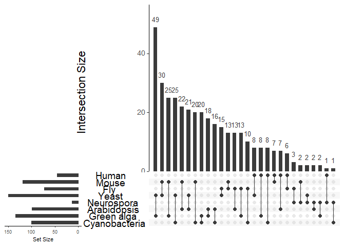

Figure1 markdown code and plot
================
Wanglab
2021.6.29

``` r
library(pheatmap)
library(ggplot2)
library(cowplot)
library(ggplotify)
library(dplyr)
```

    ## 
    ## Attaching package: 'dplyr'

    ## The following objects are masked from 'package:stats':
    ## 
    ##     filter, lag

    ## The following objects are masked from 'package:base':
    ## 
    ##     intersect, setdiff, setequal, union

``` r
library(VennDiagram)
```

    ## Loading required package: grid

    ## Loading required package: futile.logger

``` r
library(forcats)
plot_heatmap_list <- list()

draw_heatmap_function <- function(exp_data_name, range1, range2, photo_name){
  rt<-read.csv(exp_data_name)
  rt <- rt[rt$meta2d_BH.Q < 0.05,]
  rt <- rt[order(rt$meta2d_phase),]
  data <- rt[,range1:range2]
  rt2<-apply(data,1,scale)
  r<-t(rt2)
  p <- as.ggplot(pheatmap(r,cluster_rows = FALSE,cluster_cols = FALSE,show_colnames = F,show_rownames = F,legend=FALSE,border=NA,color = colorRampPalette(c("black","purple","purple","yellow","yellow","yellow"))(20)))
  plot_heatmap_list <<- c(plot_heatmap_list, list(p))
}


draw_heatmap_function('ContainedData/Meta2dResult/AllSpecies/Mouse_LIV.csv',  24,35, "Mouse liver")
```

``` r
draw_heatmap_function('ContainedData/Meta2dResult/AllSpecies/Mouse_KID.csv',  24,35, "Mouse kidney")
```

``` r
draw_heatmap_function('ContainedData/Meta2dResult/AllSpecies/Fly_old.csv',  24,35, "Fly old")
```

``` r
draw_heatmap_function('ContainedData/Meta2dResult/AllSpecies/Fly_young.csv',  24,35, "Fly young")
```

``` r
draw_heatmap_function('ContainedData/Meta2dResult/AllSpecies/Human_blood_for_heatmap.csv',  19,28,"Human blood")
```

``` r
draw_heatmap_function('ContainedData/Meta2dResult/AllSpecies/Human_skin_for_heatmap.csv',  19,22,"Human skin")
```

``` r
draw_heatmap_function('ContainedData/Meta2dResult/AllSpecies/Yeast_high.csv',  24,43,"Yeast high")
```

``` r
draw_heatmap_function('ContainedData/Meta2dResult/AllSpecies/Yeast_low.csv',  24,47,"Yeast low")
```

``` r
draw_heatmap_function('ContainedData/Meta2dResult/AllSpecies/Arabidopsis_SD LEAF.csv',  24,35,"Arabidopsis SD leaf")
```

``` r
draw_heatmap_function('ContainedData/Meta2dResult/AllSpecies/Arabidopsis_SD M.csv',  24,35,"Arabidopsis SD M")
```

``` r
draw_heatmap_function('ContainedData/Meta2dResult/AllSpecies/Arabidopsis_SD VA.csv',  24,35,"Arabidopsis SD VA")
```

``` r
draw_heatmap_function('ContainedData/Meta2dResult/AllSpecies/Neurospora.csv',  24,35,"Neurospora")
```

``` r
draw_heatmap_function('ContainedData/Meta2dResult/AllSpecies/Chlamydomounas_for_heatmap.csv',  19,26,"Chlamydomounas")
```

``` r
draw_heatmap_function('ContainedData/Meta2dResult/AllSpecies/Cyanobacteria_for_heatmap.csv',  19,28,"Cyanobacteria")
```

``` r
heatmap_plot_for_8species <- plot_grid(plotlist = plot_heatmap_list,nrow=1, ncol=14, axis="bl",rel_widths=c(1,1,1))
heatmap_plot_for_8species
```

<!-- -->

``` r
library(VennDiagram)
library(ggplot2)
library(cowplot)
library(ggplotify)
library(dplyr)
library(forcats)
source("draw_pairwise_venn_pro_function.R")
species_sort <- c('human','mouse','fly','arabidopsis','yeast','neurospora','chlamydomonas','cyanobacteria')
species <- c('human','mouse','fly','yeast','neurospora','arabidopsis','chlamydomonas','cyanobacteria')
gene_num_list <- data.frame(0,0)
colnames(gene_num_list) <- c("species","gene_num")
venn_data <- data.frame(0,0,0,0,0)
colnames(venn_data) <- c("species1","species2","num1","num2","overlap")
for(i in 1:(length(species) - 1))
{
  for(j in (i+1):length(species))
  {
    current_file_name <- paste(paste(paste(paste("E:/circidian_algorithm/orthoFinder_result/new_result_longest_true/protein2gene_20210122/",species[i],sep=""),'__v__',sep=""), species[j],sep=""),".txt",sep="")
    if (file.exists(current_file_name))
    {
      gene_list <- unique(read.table(current_file_name))
      current_file_gene1_name <- paste(paste("E:/circidian_algorithm/BeforeCommit/final_cycling data_8 species/tissue14/circidian_gene/",species[i],sep=""),"_gene.csv",sep="")
      current_file_gene2_name <- paste(paste("E:/circidian_algorithm/BeforeCommit/final_cycling data_8 species/tissue14/circidian_gene/",species[j],sep=""),"_gene.csv",sep="")
      gene1 <- read.csv(current_file_gene1_name,header = T)
      gene2 <- read.csv(current_file_gene2_name,header = T)
      
      
      
      gene1_num <- 0
      gene2_num <- 0
      overlap <- 0
      num <- 0
      gene1_total_num <- c()
      gene2_total_num <- 0
      for(k in 1:ncol(gene1))
      {
        for(l in 1:ncol(gene2))
        {
          num <- num + 1
          if(which(species_sort == species[i]) < which(species_sort == species[j]))
          {
            current_gene1 <- gene_list[gene_list$V1 %in% gene1[,k],]$V1
            current_gene2 <- gene_list[gene_list$V2 %in% gene2[,l],]$V1
            gene1_num <- gene1_num + length(unique(current_gene1))
            gene2_num <- gene2_num + length(unique(current_gene2))
            
          }else
          {
            current_gene1 <- gene_list[gene_list$V1 %in% gene1[,k],]$V2
            current_gene2 <- gene_list[gene_list$V2 %in% gene2[,l],]$V2
            gene1_num <- gene1_num + length(unique(current_gene1))
            gene2_num <- gene2_num + length(unique(current_gene2))
            
          }
          overlap <- overlap + length(intersect(current_gene1, current_gene2))
          
        }
      }
      gene1_num <- gene1_num / num
      gene2_num <- gene2_num / num
      overlap <- overlap / num

      temp_row <- c(species[i], species[j], gene1_num, gene2_num, overlap)
      venn_data <- rbind(venn_data, temp_row)
      gene_num_list <- rbind(gene_num_list,c(species[i],length(unique(gene1_total_num))))
      gene_num_list <- rbind(gene_num_list,c(species[j],length(unique(gene2_total_num))))
    }else
    {
      current_file_name <- paste(paste(paste(paste("E:/circidian_algorithm/orthoFinder_result/new_result_longest_true/protein2gene_20210122/",species[j],sep=""),'__v__',sep=""), species[i],sep=""),".txt",sep="")
      gene_list <- unique(read.table(current_file_name))
      current_file_gene1_name <- paste(paste("E:/circidian_algorithm/BeforeCommit/final_cycling data_8 species/tissue14/circidian_gene/",species[j],sep=""),"_gene.csv",sep="")
      current_file_gene2_name <- paste(paste("E:/circidian_algorithm/BeforeCommit/final_cycling data_8 species/tissue14/circidian_gene/",species[i],sep=""),"_gene.csv",sep="")
      gene1 <- read.csv(current_file_gene1_name,header = T)
      gene2 <- read.csv(current_file_gene2_name,header = T)
      gene1_num <- 0
      gene2_num <- 0
      overlap <- 0
      num <- 0
      for(k in 1:ncol(gene1))
      {
        for(l in 1:ncol(gene2))
        {
          num <- num + 1
          if(which(species_sort == species[i]) > which(species_sort == species[j]))
          {
            current_gene1 <- gene_list[gene_list$V1 %in% gene1[,k],]$V1
            current_gene2 <- gene_list[gene_list$V2 %in% gene2[,l],]$V1
            gene1_num <- gene1_num + length(unique(current_gene1))
            gene2_num <- gene2_num + length(unique(current_gene2))
            
          }else
          {
            current_gene1 <- gene_list[gene_list$V1 %in% gene1[,k],]$V2
            current_gene2 <- gene_list[gene_list$V2 %in% gene2[,l],]$V2
            gene1_num <- gene1_num + length(unique(current_gene1))
            gene2_num <- gene2_num + length(unique(current_gene2))
            
          }
          overlap <- overlap + length(intersect(current_gene1, current_gene2))
          
        }
      }
      gene1_num <- gene1_num / num
      gene2_num <- gene2_num / num
      overlap <- overlap / num
      temp_row <- c(species[j], species[i], gene1_num, gene2_num, overlap)
      venn_data <- rbind(venn_data, temp_row)

    }
  }
}

gene_num_list <- data.frame(0,0)
colnames(gene_num_list) <- c("species","gene_num")
for(i in 1:length(species))
{
  current_file_gene_name <- paste(paste("E:/circidian_algorithm/BeforeCommit/final_cycling data_8 species/tissue14/circidian_gene/",species[i],sep=""),"_gene.csv",sep="")
  current_data_gene <- read.csv(current_file_gene_name)
  for(j in 1:ncol(current_data_gene))
  {
    if(j == 1)
    {
      temp_gene <- as.character(current_data_gene[,j])
    }else
    {
      temp_gene <- c(temp_gene, as.character(current_data_gene[,j]))
    }
  }
  gene_num_list <- rbind(gene_num_list, c(species[i], as.character(length(unique(temp_gene)))))
}


gene_num_list <- gene_num_list[-1,]
gene_num_list$gene_num <- as.numeric(gene_num_list$gene_num)
venn_data_new <- venn_data[2:nrow(venn_data),]
#write.csv(venn_data_new,"E:/cyclingdata/final_ cycling data/venn_data.csv")
######draw venn plots
#venn_data_new <- read.csv("E:/cyclingdata/final_ cycling data/venn_data.csv")
plot_list = list()
for(i in 1:nrow(venn_data_new))
{
  data1_all = as.numeric(venn_data_new[i,3])
  data2_all = as.numeric(venn_data_new[i,4])
  common_num = as.numeric(venn_data_new[i,5])
  if(data1_all > data2_all)
  {
    number_flag = 0
  }else
  {
    number_flag = 180
  }

  temp_plot <- draw.pairwise.venn.pro(
    area1 = ceiling(data1_all),
    area2 = ceiling(data2_all),
    cross.area = ceiling(common_num),
    filename=NULL,
    rotation.degree = number_flag, 
    resolution =300,
    col="black", 
    fill=c(colors()[38], 'steelblue2'),
    lwd=c(1, 1),
    cex = 0,
    cat.dist=c(-0.07, -0.07),
    cat.pos=c(60, 300),
    ext.percent = 0,
    euler.d = T,
    scaled = T,
    sep.dist = 0.01,
    set.maxcircle = T,
    maxcirclearea = 7000,
    # inverted = T,
  )
  plot_list <- c(plot_list, list(temp_plot))
}
```

``` r
grid.newpage()


overlap_data <- data.frame(nrow=21, ncol=2)
for(i in 1:nrow(venn_data_new))
{
  if(i == 1)
  { 
    name = paste(venn_data_new[i,1], venn_data_new[i,2],sep="_")
    overlap_data[i,] <- c(name,as.numeric(venn_data_new$overlap[i]))
  }else
  {
    name = paste(venn_data_new[i,1], venn_data_new[i,2],sep="_")
    overlap_data[i,] <- c(name,as.numeric(venn_data_new$overlap[i]))
  }
}

overlap_data$ncol <- as.numeric(overlap_data$ncol)
plot_data1 <- list()
temp_matrix <- matrix(1:64,byrow=TRUE,nrow=8)
temp_num <- temp_matrix[upper.tri(temp_matrix)]
temp_num <- sort(temp_num)
plot_data1[c(temp_num)] = plot_list 
#grid.newpage()
species1 <- c('chlamydomonas','cyanobacteria','arabidopsis','neurospora','yeast','fly','mouse','human')
p.hist.len <- ggplot(gene_num_list, mapping=aes(x=species,y=gene_num,fill=species,group=factor(1))) + geom_bar(stat="identity")
#p.hist.wid <- ggplot(iris) + geom_histogram(aes(x=Sepal.Width)) + coord_flip()
p.hist.wid <- ggplot(overlap_data, mapping=aes(x=nrow,y=ncol,fill=overlap_data[,1], group=factor(1))) + geom_bar(stat="identity") + coord_flip() + theme(legend.position = "none")
p.scatter<-ggplot(data=overlap_data, aes(x=overlap_data[,1], y=overlap_data[,2]))+geom_point(color='1',size=0) + scale_x_discrete(species) + theme_bw()  + theme(panel.border = element_blank() ,panel.grid.major = element_blank(), panel.grid.minor = element_blank(),axis.line = element_line(colour = "black"))

vp.len <- viewport(x=0, y=0.66, width=0.66, height=0.34, just=c("left", "bottom"))
vp.wid <- viewport(x=0.66, y=0, width=0.34, height=0.66, just=c("left", "bottom"))
vp.scatter <- viewport(x=0, y=0, width=0.66, height=0.66, just=c("left", "bottom"))
vp.scatter1 <- viewport(x=0.11, y=0.09, width=0.50, height=0.50, just=c("left", "bottom"))

print(plot_grid(plotlist = plot_data1,nrow=8, ncol=8, axis="bl",rel_widths=c(1,1,1)))
```

<!-- -->

``` r
#upset
library(UpSetR)
percentage <- as.numeric(venn_data_new$overlap) / (as.numeric(venn_data_new$num1) + as.numeric(venn_data_new$num2) - as.numeric(venn_data_new$overlap)) * 100
number <- percentage
names(number) <- c("Human&Mouse","Human&Fly","Human&Yeast","Human&Neurospora","Human&Arabidopsis","Human&Green alga","Human&Cyanobacteria","Mouse&Fly","Mouse&Yeast","Mouse&Neurospora","Mouse&Arabidopsis","Mouse&Green alga","Mouse&Cyanobacteria","Fly&Yeast","Fly&Neurospora","Fly&Arabidopsis","Fly&Green alga","Fly&Cyanobacteria","Yeast&Neurospora","Yeast&Arabidopsis","Yeast&Green alga","Yeast&Cyanobacteria","Neurospora&Arabidopsis","Neurospora&Green alga","Neurospora&Cyanobacteria","Arabidopsis&Green alga","Arabidopsis&Cyanobacteria","Green alga&Cyanobacteria")
number
```

    ##               Human&Mouse                 Human&Fly               Human&Yeast 
    ##                  6.356711                  5.869049                  6.397037 
    ##          Human&Neurospora         Human&Arabidopsis          Human&Green alga 
    ##                  1.463415                  6.449933                  6.596887 
    ##       Human&Cyanobacteria                 Mouse&Fly               Mouse&Yeast 
    ##                  7.638889                 10.984147                 18.509364 
    ##          Mouse&Neurospora         Mouse&Arabidopsis          Mouse&Green alga 
    ##                  1.434720                 16.010648                 16.319489 
    ##       Mouse&Cyanobacteria                 Fly&Yeast            Fly&Neurospora 
    ##                 14.802065                 13.623661                  2.664693 
    ##           Fly&Arabidopsis            Fly&Green alga         Fly&Cyanobacteria 
    ##                 12.608512                 12.961343                 11.185682 
    ##          Yeast&Neurospora         Yeast&Arabidopsis          Yeast&Green alga 
    ##                  2.004742                 20.269849                 41.945423 
    ##       Yeast&Cyanobacteria    Neurospora&Arabidopsis     Neurospora&Green alga 
    ##                 23.521682                  2.591748                  1.749871 
    ##  Neurospora&Cyanobacteria    Arabidopsis&Green alga Arabidopsis&Cyanobacteria 
    ##                  1.604278                 18.568189                 16.396845 
    ##  Green alga&Cyanobacteria 
    ##                 20.253165

``` r
data <- fromExpression(number)
upset(data,nsets = 28,keep.order=TRUE,order.by="freq", sets=c("Cyanobacteria","Green alga","Arabidopsis","Neurospora","Yeast","Fly","Mouse","Human"), text.scale = c(2,1.5,1,1,2,1.5))
```

<!-- -->
