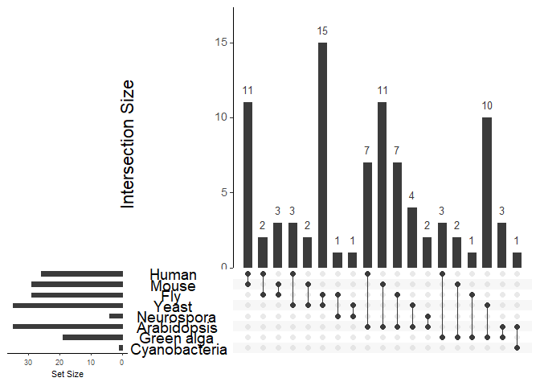
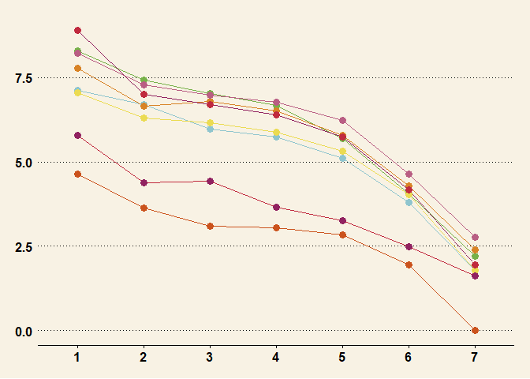
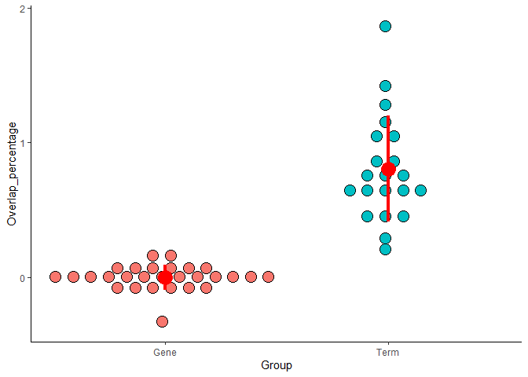

Figure2 markdown code and plot
================
Wanglab
2021.2.19

``` r
library(VennDiagram)
```

    ## Loading required package: grid

    ## Loading required package: futile.logger

``` r
library(ggplot2)
```

    ## Warning: package 'ggplot2' was built under R version 4.0.5

``` r
library(cowplot)
library(ggplotify)
```

    ## Warning: package 'ggplotify' was built under R version 4.0.5

``` r
library(dplyr)
```

    ## Warning: package 'dplyr' was built under R version 4.0.5

    ## 
    ## Attaching package: 'dplyr'

    ## The following objects are masked from 'package:stats':
    ## 
    ##     filter, lag

    ## The following objects are masked from 'package:base':
    ## 
    ##     intersect, setdiff, setequal, union

``` r
library(forcats)
```

    ## Warning: package 'forcats' was built under R version 4.0.5

``` r
library(UpSetR)
library(ggpubr)
```

    ## 
    ## Attaching package: 'ggpubr'

    ## The following object is masked from 'package:cowplot':
    ## 
    ##     get_legend

    ## The following object is masked from 'package:VennDiagram':
    ## 
    ##     rotate

``` r
library(ggsci)
#calculate overlap percentage of gene ontology terms in different species
file_dir <- "ContainedData/Plot_required_file/tissue14/enrich/"
species <- c("Human","Mouse","Fly","Yeast","Neurospora","Arabidopsis","Green alga","Cyanobacteria")
term_venn_data <- data.frame(0,0,0, 0, 0)
for(i in 1:(length(species)-1))
{
  for(j in (i + 1):length(species))
  {
    #get names of current 2 species to compare
    current_file1_name <- paste(file_dir, species[i],".csv",sep="")
    current_file2_name <- paste(file_dir,species[j],".csv",sep="")
    current_file1 <- read.csv(current_file1_name)
    current_file2 <- read.csv(current_file2_name)
    species1_term_num <- 0
    species2_term_num <- 0
    overlap_num <- 0
    num <- 0
    #calculate percentage of overlap terms 
    for(k in 1:ncol(current_file1))
    {
      for(l in 1:ncol(current_file2))
      {
        current_data1 <- unique(current_file1[,k])
        current_data2 <- unique(current_file2[,l])
        num <- num + 1
        species1_term_num <- species1_term_num + length(current_data1)
        species2_term_num <- species2_term_num + length(current_data2)
        overlap_num<- overlap_num + length(intersect(current_data1,current_data2))
      }
    }
    temp_row <- c(species[i], species[j], species1_term_num/num, species2_term_num/num, overlap_num/num)
    term_venn_data <- rbind(term_venn_data, temp_row)
   
  }
}

#prepare data format for plotting
term_venn_data <- term_venn_data[-1,]
percentage_list <- as.numeric(term_venn_data$X0.4) / (as.numeric(term_venn_data$X0.2) + as.numeric(term_venn_data$X0.3) - as.numeric(term_venn_data$X0.4))
percentage_name <- paste0(term_venn_data$X0," vs ",term_venn_data$X0.1)

#draw percentage plot
plot_data <- data.frame(percentage_list, percentage_name)
colnames(plot_data) <- c("Percentage", "Species")
plot_data_percentage <- plot_data[plot_data$Percentage!=0,1]
number <- plot_data_percentage
names(number) <- c("Human&Mouse","Human&Fly","Human&Yeast","Human&Neurospora","Human&Arabidopsis","Human&Green alga","Mouse&Fly","Mouse&Yeast","Mouse&Neurospora","Mouse&Arabidopsis","Mouse&Green alga","Mouse&Cyanobacteria","Fly&Yeast","Fly&Neurospora","Fly&Arabidopsis","Fly&Green alga","Fly&Cyanobacteria","Yeast&Neurospora","Yeast&Arabidopsis","Yeast&Green alga","Neurospora&Arabidopsis","Arabidopsis&Green alga","Arabidopsis&Cyanobacteria")
number
```

    ##               Human&Mouse                 Human&Fly               Human&Yeast 
    ##               0.115971223               0.024437928               0.035799523 
    ##          Human&Neurospora         Human&Arabidopsis          Human&Green alga 
    ##               0.009685230               0.070353982               0.039534884 
    ##                 Mouse&Fly               Mouse&Yeast          Mouse&Neurospora 
    ##               0.031622912               0.026620733               0.009334163 
    ##         Mouse&Arabidopsis          Mouse&Green alga       Mouse&Cyanobacteria 
    ##               0.113078768               0.025450031               0.002531646 
    ##                 Fly&Yeast            Fly&Neurospora           Fly&Arabidopsis 
    ##               0.151670951               0.014705882               0.073185363 
    ##            Fly&Green alga         Fly&Cyanobacteria          Yeast&Neurospora 
    ##               0.017167382               0.005952381               0.017391304 
    ##         Yeast&Arabidopsis          Yeast&Green alga    Neurospora&Arabidopsis 
    ##               0.049033149               0.105263158               0.023709902 
    ##    Arabidopsis&Green alga Arabidopsis&Cyanobacteria 
    ##               0.030423280               0.018045113

``` r
number <- number*100
data <- fromExpression(number)
upset(data,nsets = 23,keep.order=TRUE,order.by="degree", sets=c("Cyanobacteria","Green alga","Arabidopsis","Neurospora","Yeast","Fly","Mouse","Human"), text.scale = c(2,1.5,1,1,2,1.5))
```

<!-- -->

``` r
source("plot_functions.R")
library(ggthemes)
```

    ## Warning: package 'ggthemes' was built under R version 4.0.5

    ## 
    ## Attaching package: 'ggthemes'

    ## The following object is masked from 'package:cowplot':
    ## 
    ##     theme_map

``` r
species_sort <- c('human','mouse','fly','arabidopsis','yeast','neurospora','cyanobacteria','chlamydomonas')
species <- c('human','mouse','fly','yeast','neurospora','arabidopsis','cyanobacteria','chlamydomonas')
gene_num_list <- data.frame(0,0)
colnames(gene_num_list) <- c("species","gene_num")

venn_data <- data.frame(0,0,0,0,0)
colnames(venn_data) <- c("species1","species2","num1","num2","overlap")
notdup_gene <- list(c(),c(),c(),c(),c(),c(),c(),c())
gene_table <- list(c(),c(),c(),c(),c(),c(),c(),c())
gene_name_table <- list(c(),c(),c(),c(),c(),c(),c(),c())
#make list for each cycling gene in different species
for(i in 1:(length(species)))
{
  current_file_gene1_name <- paste(paste("ContainedData/Plot_required_file/tissue14/circidian_gene/",species[i],sep=""),"_gene.csv",sep="")
  gene1 <- read.csv(current_file_gene1_name,header = T)
  for(k in 1:ncol(gene1))
  {
    for(l in 1:nrow(gene1)){
      if(!(gene1[l,k] %in% gene_name_table[[i]])){
        gene_name_table[[i]][length(gene_name_table[[i]])+1] <- as.character(gene1[l,k])
        gene_table[[i]][length(gene_name_table[[i]])] <- 1
      }
    }
  }
}
#count number of orthology cycling gene in different species
gene_table <- get_cycling_gene_orthologue_distribution(gene_name_table, gene_table)

output_data <- data.frame(0,0,0)
for(i in 1:8){
  for(j in 1:length(gene_name_table[[i]])){
    temp <- c(as.character(gene_name_table[[i]][j]), as.character(gene_table[[i]][j]), as.character(species[i]))
    output_data <- rbind(output_data, temp)
  }
}

#prepare data format for plotting
new_temp <- data.frame(0,0,0)
colnames(new_temp) <- c("overlap number", "species","number")
for(i in 1:length(species)){
  temp <- table(output_data[output_data$X0.2==species[i],2:3])
  temp <- data.frame(temp)
  colnames(temp) <- c("overlap number", "species","number")
  new_temp <- rbind(new_temp, temp)
}

new_temp$`number` <- log(as.numeric(new_temp$`number`))
colnames(new_temp) <- c("overlap number", "species","number")
new_temp <- new_temp[-1,]
new_temp$species <- factor(new_temp$species,levels=c("human","mouse","fly","yeast","neurospora","arabidopsis","chlamydomonas","cyanobacteria"))
#plot result
pf2b1 = ggplot(new_temp, aes(x=`overlap number`, y=number,group=species)) + geom_line(color=c(rep("#8FC5CE",7),rep("#77B149",7),rep("#EBDB52",7),rep("#D88326",7),rep("#CB531D",7),rep("#B95E83",7),rep("#912260",7),rep("#C02A3E",7))) +geom_point(size=3, color=c(rep("#8FC5CE",7),rep("#77B149",7),rep("#EBDB52",7),rep("#D88326",7),rep("#CB531D",7),rep("#B95E83",7),rep("#912260",7),rep("#C02A3E",7)))+xlab(NULL)+ylab("Number (log)")+
  theme(plot.title = element_text(size=20,face = "bold"),axis.line.y=element_line(linetype=1,color="black",size=1),axis.line.x=element_line(linetype=1,color="black",size=0.1),axis.text.y=element_text(size=15),axis.text.x=element_blank(),axis.title.y=element_text(size=15,face="bold"),axis.title.x=element_text(size=15,face="bold"),panel.grid.major =element_blank(), panel.grid.minor = element_blank(), panel.background = element_blank())+theme_wsj()

pf2b1
```

<!-- -->

``` r
source("plot_functions.R")
file_dir <- "ContainedData/Plot_required_file/tissue14/enrich/"
species <- c("Human","Mouse","Fly","Yeast","Neurospora","Arabidopsis","Green alga","Cyanobacteria")

species_sort <- c('human','mouse','fly','arabidopsis','yeast','neurospora','cyanobacteria','chlamydomonas')
#species <- c('human','mouse','fly','yeast','neurospora','arabidopsis','cyanobacteria','chlamydomonas')
gene_num_list <- data.frame(0,0)
colnames(gene_num_list) <- c("species","gene_num") 

venn_data <- data.frame(0,0,0,0,0)
colnames(venn_data) <- c("species1","species2","num1","num2","overlap")
notdup_gene <- list(c(),c(),c(),c(),c(),c(),c(),c())
gene_table <- list(c(),c(),c(),c(),c(),c(),c(),c())
gene_name_table <- list(c(),c(),c(),c(),c(),c(),c(),c())
#make list for each go term in different species
for(i in 1:(length(species)))
{
  current_file_gene1_name <- paste(paste("ContainedData/Plot_required_file/tissue14/enrich/",species[i],sep=""),".csv",sep="")
  gene1 <- read.csv(current_file_gene1_name,header = T)
  for(k in 1:ncol(gene1))
  {
    for(l in 1:nrow(gene1)){
      if(!(gene1[l,k] %in% gene_name_table[[i]])){
        gene_name_table[[i]][length(gene_name_table[[i]])+1] <- as.character(gene1[l,k])
        gene_table[[i]][length(gene_name_table[[i]])] <- 1
      }
    }
  }
}
#count number of go term in different species
gene_table <- get_go_term_orthologue_function(gene_name_table, gene_table)

output_data <- data.frame(0,0,0)
for(i in 1:8){
  for(j in 1:length(gene_name_table[[i]])){
    temp <- c(as.character(gene_name_table[[i]][j]), as.character(gene_table[[i]][j]), as.character(species[i]))
    output_data <- rbind(output_data, temp)
  }
}
#prepare data format for plotting
new_temp <- data.frame(0,0,0)
colnames(new_temp) <- c("overlap number", "species","number")
for(i in 1:length(species)){
  temp <- table(output_data[output_data$X0.2==species[i],2:3])
  temp <- data.frame(temp)
  colnames(temp) <- c("overlap number", "species","number")
  new_temp <- rbind(new_temp, temp)
}
adddf = data.frame(c(1,5,6),"Cyanobacteria",1/exp(1))
colnames(adddf) <- c("overlap number", "species","number")
new_temp = rbind(new_temp,adddf)
adddf = data.frame(c(6),"Green alga",1/exp(1))
colnames(adddf) <- c("overlap number", "species","number")
new_temp = rbind(new_temp,adddf)
new_temp$`number` <- log(as.numeric(new_temp$`number`))
colnames(new_temp) <- c("overlap number", "species","number")
new_temp <- new_temp[-1,]
new_temp$species <- factor(new_temp$species,levels=c("Human","Mouse","Fly","Yeast","Neurospora","Arabidopsis","Green alga","Cyanobacteria"))
# new_temp <- new_temp[new_temp$number != 0,]
#plot result

pf2b2 = ggplot(new_temp, aes(x=`overlap number`, y=number,group=species)) +
  geom_line(color=c(rep("#8FC5CE",6),rep("#77B149",6),rep("#EBDB52",6),rep("#D88326",6),rep("#CB531D",6),rep("#B95E83",6),rep("#912260",6),rep("#C02A3E",6))) +
  geom_point(size=3, color=c(rep("#8FC5CE",6),rep("#77B149",6),rep("#EBDB52",6),rep("#D88326",6),rep("#CB531D",6),rep("#B95E83",6),rep("#912260",6),rep("#C02A3E",6))) +
  xlab(NULL)+ylab("Number (log)") +
  theme(plot.title = element_text(size=20,face = "bold"),axis.line.y=element_line(linetype=1,color="black",size=1),axis.line.x=element_line(linetype=1,color="black",size=0.1),axis.text.y=element_text(size=15),axis.text.x=element_blank(),axis.title.y=element_text(size=15,face="bold"),axis.title.x=element_text(size=15,face="bold"),panel.grid.major =element_blank(), panel.grid.minor = element_blank(), panel.background = element_blank()) +
  theme_wsj()

pf2b2
```

<!-- -->

``` r
#compare overlap percentage of cycling gene and go term within or without species in mouse and arabidopsis
within_species <- c()
without_species <- c()

mouse_go <- read.csv("ContainedData/Plot_required_file/tissue14/enrich/Mouse.csv")
human_go <- read.csv("ContainedData/Plot_required_file/tissue14/enrich/Human.csv")
fly_go <- read.csv("ContainedData/Plot_required_file/tissue14/enrich/Fly.csv")
arabidopsis_go <- read.csv("ContainedData/Plot_required_file/tissue14/enrich/Arabidopsis.csv")
yeast_go <- read.csv("ContainedData/Plot_required_file/tissue14/enrich/Yeast.csv")

within_species <- c(within_species, as.numeric(length(intersect(unique(mouse_go[,1]), unique(mouse_go[,2])))) / as.numeric((length(unique(mouse_go[,1])) + length(unique(mouse_go[,2]))) - length(intersect(unique(mouse_go[,1]), unique(mouse_go[,2])))))
within_species <- c(within_species, as.numeric(length(intersect(unique(human_go[,1]), unique(human_go[,2])))) / as.numeric((length(unique(human_go[,1])) + length(unique(human_go[,2]))) - length(intersect(unique(human_go[,1]), unique(human_go[,2])))))
within_species <- c(within_species, as.numeric(length(intersect(unique(fly_go[,1]), unique(fly_go[,2])))) / as.numeric((length(unique(fly_go[,1])) + length(unique(fly_go[,2]))) - length(intersect(unique(fly_go[,1]), unique(fly_go[,2])))))
within_species <- c(within_species, as.numeric(length(intersect(unique(yeast_go[,1]), unique(yeast_go[,2])))) / as.numeric((length(unique(yeast_go[,1])) + length(unique(yeast_go[,2]))) - length(intersect(unique(yeast_go[,1]), unique(yeast_go[,2])))))
within_species <- c(within_species, as.numeric(length(intersect(unique(arabidopsis_go[,1]), unique(arabidopsis_go[,2])))) / as.numeric((length(unique(arabidopsis_go[,1])) + length(unique(arabidopsis_go[,2]))) - length(intersect(unique(arabidopsis_go[,1]), unique(arabidopsis_go[,2])))))
within_species <- c(within_species, as.numeric(length(intersect(unique(arabidopsis_go[,1]), unique(arabidopsis_go[,3])))) / as.numeric((length(unique(arabidopsis_go[,1])) + length(unique(arabidopsis_go[,3]))) - length(intersect(unique(arabidopsis_go[,1]), unique(arabidopsis_go[,3])))))
within_species <- c(within_species, as.numeric(length(intersect(unique(arabidopsis_go[,2]), unique(arabidopsis_go[,3])))) / as.numeric((length(unique(arabidopsis_go[,2])) + length(unique(arabidopsis_go[,3]))) - length(intersect(unique(arabidopsis_go[,2]), unique(arabidopsis_go[,3])))))

without_species <- percentage_list
# cir_outVals <- boxplot(within_species, plot=FALSE)$out
# non_cir_outVals <-   boxplot(without_species, plot=FALSE)$out
# within_species <- within_species[! within_species %in% cir_outVals]
# without_species <- without_species[! without_species %in% non_cir_outVals]

data <- data.frame(c(within_species, without_species), c(rep("Within species", length(within_species)), rep("Without species", length(without_species))))
colnames(data) <- c("Overlap_percentage", "Group")
data_summary <- function(x) {
  m <- mean(x)
  ymin <- m-sd(x)
  ymax <- m+sd(x)
  return(c(y=m,ymin=ymin,ymax=ymax))
}

pf2c1 = ggplot(data, aes(x=Group, y=Overlap_percentage, fill = Group)) +
  geom_dotplot(binaxis='y', stackdir='center', stackratio=1.5, dotsize=1.2)+
  stat_summary(fun.data =  data_summary, colour = "red", size = 1.2) +
  stat_compare_means(method = "wilcox.test", label.x = 1.5)+
  theme(panel.grid.major =element_blank(), panel.grid.minor = element_blank(), panel.background = element_blank(),axis.line = element_line(colour = "black"))+scale_y_continuous(n.breaks = 3)+
  theme(legend.position="none")
pf2c1
```

    ## Bin width defaults to 1/30 of the range of the data. Pick better value with `binwidth`.

<!-- -->

``` r
library(VennDiagram)
library(ggplot2)
library(cowplot)
library(ggplotify)
library(dplyr)
library(forcats)
#compare overlap percentage of cycling gene and go term in 8 species
source("plot_functions.R")
source("draw_pairwise_venn_pro_function.R")
venn_data <- get_or_gene()
```

    ## [1] 0.8641518
    ## odds ratio 
    ##  0.9892466 
    ## [1] 1.439895e-18
    ## odds ratio 
    ##   1.854574 
    ## [1] 0.4975545
    ## odds ratio 
    ##  0.9604372 
    ## [1] 4.491396e-12
    ## odds ratio 
    ##   1.626433 
    ## [1] 0.07543157
    ## odds ratio 
    ##   1.171552 
    ## [1] 0.5940002
    ## odds ratio 
    ##   1.056901 
    ## [1] 0.05663955
    ## odds ratio 
    ##   1.184579 
    ## [1] 0.8318159
    ## odds ratio 
    ##   1.025445 
    ## [1] 0.782139
    ## odds ratio 
    ##   1.047946 
    ## [1] 0.7505376
    ## odds ratio 
    ##  0.9464392 
    ## [1] 0.6746083
    ## odds ratio 
    ##   1.056763 
    ## [1] 0.490785
    ## odds ratio 
    ##   0.909048 
    ## [1] 1
    ## odds ratio 
    ##   0.971156 
    ## [1] 0.3796719
    ## odds ratio 
    ##  0.6246439 
    ## [1] 0.839801
    ## odds ratio 
    ##   1.023338 
    ## [1] 0.7695914
    ## odds ratio 
    ##  0.9629587 
    ## [1] 0.6433251
    ## odds ratio 
    ##   1.049136 
    ## [1] 0.8114096
    ## odds ratio 
    ##   1.034175 
    ## [1] 0.9176668
    ## odds ratio 
    ##  0.9859358 
    ## [1] 0.3689945
    ## odds ratio 
    ##   1.113909 
    ## [1] 0.05655874
    ## odds ratio 
    ##   1.245434 
    ## [1] 0.5664867
    ## odds ratio 
    ##   0.927046 
    ## [1] 0.2768972
    ## odds ratio 
    ##   1.340575 
    ## [1] 0.7232181
    ## odds ratio 
    ##   1.111481 
    ## [1] 0.8347426
    ## odds ratio 
    ##   1.012654 
    ## [1] 0.010535
    ## odds ratio 
    ##  0.8581814 
    ## [1] 0.5947843
    ## odds ratio 
    ##   1.032073 
    ## [1] 0.7930848
    ## odds ratio 
    ##  0.9833047 
    ## [1] 0.8236893
    ## odds ratio 
    ##   1.022467 
    ## [1] 0.4075792
    ## odds ratio 
    ##   1.077177 
    ## [1] 0.4372514
    ## odds ratio 
    ##  0.9402436 
    ## [1] 0.5183755
    ## odds ratio 
    ##  0.9510532 
    ## [1] 0.4728749
    ## odds ratio 
    ##  0.8603827 
    ## [1] 0.04309106
    ## odds ratio 
    ##  0.6857874 
    ## [1] 0.03251919
    ## odds ratio 
    ##    1.15554 
    ## [1] 0.1327731
    ## odds ratio 
    ##   1.105477 
    ## [1] 0.5627161
    ## odds ratio 
    ##   1.042075 
    ## [1] 0.5489226
    ## odds ratio 
    ##   1.041463 
    ## [1] 0.4328197
    ## odds ratio 
    ##   1.056014 
    ## [1] 0.06169264
    ## odds ratio 
    ##   1.134317 
    ## [1] 0.3482336
    ## odds ratio 
    ##  0.9341797 
    ## [1] 0.0476386
    ## odds ratio 
    ##  0.8690096 
    ## [1] 0.5619609
    ## odds ratio 
    ##   1.123148 
    ## [1] 0.0002974371
    ## odds ratio 
    ##   1.968384 
    ## [1] 0.3739671
    ## odds ratio 
    ##   1.129849 
    ## [1] 0.2991261
    ## odds ratio 
    ##   1.147716 
    ## [1] 0.05479411
    ## odds ratio 
    ##   1.247679 
    ## [1] 0.2917243
    ## odds ratio 
    ##   1.123616 
    ## [1] 1
    ## odds ratio 
    ##  0.9790472 
    ## [1] 1
    ## odds ratio 
    ##  0.9955204 
    ## [1] 1
    ## odds ratio 
    ##   1.002398 
    ## [1] 0.3183115
    ## odds ratio 
    ##   1.097161 
    ## [1] 0.4319488
    ## odds ratio 
    ##   1.082378 
    ## [1] 0.09760757
    ## odds ratio 
    ##   1.171504 
    ## [1] 0.8460739
    ## odds ratio 
    ##   1.022832 
    ## [1] 0.9255511
    ## odds ratio 
    ##   1.008938 
    ## [1] 0.5749575
    ## odds ratio 
    ##  0.9455504 
    ## [1] 0.1477944
    ## odds ratio 
    ##  0.8640159 
    ## [1] 0.8922377
    ## odds ratio 
    ##  0.9311663 
    ## [1] 0.6005075
    ## odds ratio 
    ##   1.146594 
    ## [1] 0.5818415
    ## odds ratio 
    ##   1.203795 
    ## [1] 0.8186239
    ## odds ratio 
    ##   1.070011 
    ## [1] 0.08264892
    ## odds ratio 
    ##   1.162071 
    ## [1] 0.01275355
    ## odds ratio 
    ##   1.186465 
    ## [1] 0.5086682
    ## odds ratio 
    ##   1.080276 
    ## [1] 0.1250242
    ## odds ratio 
    ##   1.150738 
    ## [1] 0.1775555
    ## odds ratio 
    ##    1.16614 
    ## [1] 0.004644167
    ## odds ratio 
    ##   1.286281 
    ## [1] 0.1546207
    ## odds ratio 
    ##   1.184786 
    ## [1] 0.4943023
    ## odds ratio 
    ##  0.9313483 
    ## [1] 0.5585582
    ## odds ratio 
    ##   1.237669 
    ## [1] 1
    ## odds ratio 
    ##  0.9842293 
    ## [1] 0.4926988
    ## odds ratio 
    ##   0.905322 
    ## [1] 0.00556613
    ## odds ratio 
    ##  0.5549062 
    ## [1] 0.93025
    ## odds ratio 
    ##  0.9710517 
    ## [1] 0.7819861
    ## odds ratio 
    ##  0.9309544 
    ## [1] 0.3075204
    ## odds ratio 
    ##   0.469629 
    ## [1] 0.1933611
    ## odds ratio 
    ##  0.9325205 
    ## [1] 0.515945
    ## odds ratio 
    ##  0.9557223 
    ## [1] 0.7626785
    ## odds ratio 
    ##   1.022458 
    ## [1] 0.4276085
    ## odds ratio 
    ##   1.098851 
    ## [1] 0.1567196
    ## odds ratio 
    ##   1.213721 
    ## [1] 0.6719976
    ## odds ratio 
    ##  0.9315718 
    ## [1] 0.2185553
    ## odds ratio 
    ##  0.8360369

``` r
venn_data_new <- venn_data[2:nrow(venn_data),]


# calculate orthologue gene in different species
#calculate overlap percentage of gene ontology terms in different species
file_dir <- "ContainedData/Plot_required_file/tissue14/enrich/"
file_dir_background <- "ContainedData/Plot_required_file/background_go/"
species <- c("Human","Mouse","Fly","Yeast","Neurospora","Arabidopsis","Green alga","Cyanobacteria")
term_venn_data <- data.frame(0,0,0, 0, 0,0,0,0,0,0)
for(i in 1:(length(species)-1))
{
  for(j in (i + 1):length(species))
  {
    #get names of current 2 species to compare
    current_file1_name <- paste(file_dir, species[i],".csv",sep="")
    current_file2_name <- paste(file_dir,species[j],".csv",sep="")
    
    current_file1_background_name <- paste(file_dir_background, species[i],".txt",sep="")
    current_file2_background_name <- paste(file_dir_background, species[j],".txt",sep="")
    
    
    current_file1 <- read.csv(current_file1_name)
    current_file2 <- read.csv(current_file2_name)
    
    current_file1_background <- read.table(current_file1_background_name)$V1
    current_file2_background <- read.table(current_file2_background_name)$V1
    
    
    species1_term_num <- 0
    species2_term_num <- 0
    overlap_num <- 0
    num <- 0
    species1_term_num_new <- 0
    species2_term_num_new <- 0
    overlap_num_new <- 0
    background <- 0
    or <- 0
    #calculate percentage of overlap terms 
    for(k in 1:ncol(current_file1))
    {
      for(l in 1:ncol(current_file2))
      {
        current_data1 <- unique(current_file1[,k])
        current_data2 <- unique(current_file2[,l])
        num <- num + 1
        species1_term_num <- species1_term_num + length(current_data1)
        species2_term_num <- species2_term_num + length(current_data2)
        overlap_num<- overlap_num + length(intersect(current_data1,current_data2))
        
        
        intersect_go <- intersect(current_file1_background, current_file2_background)
        current_data1_new <- intersect(current_data1, intersect_go)
        current_data2_new <- intersect(current_data2, intersect_go)
        
        id_cir1 <- intersect_go %in% current_data1_new
        id_cir2 <- intersect_go %in% current_data2_new
        
        res_fishertest = fisher.test(id_cir1,id_cir2)
        or <- or + res_fishertest$estimate
        species1_term_num_new <- species1_term_num_new + length(current_data1_new)
        species2_term_num_new <- species2_term_num_new + length(current_data2_new)
        overlap_num_new <- overlap_num_new + length(intersect(current_data1_new, current_data2_new))
        background <- background + length(intersect_go)
        print(res_fishertest$p.value)
        print(res_fishertest$estimate)
        
      }
    }
    temp_row <- c(species[i], species[j], species1_term_num/num, species2_term_num/num, overlap_num/num, species1_term_num_new/num, species2_term_num_new/num, overlap_num_new/num, background/num, or/num)
    term_venn_data <- rbind(term_venn_data, temp_row)
    
  }
}
```

    ## [1] 1
    ## odds ratio 
    ##  0.9730136 
    ## [1] 0.0688269
    ## odds ratio 
    ##    3.51694 
    ## [1] 2.90349e-129
    ## odds ratio 
    ##   22.24598 
    ## [1] 3.05091e-214
    ## odds ratio 
    ##   49.73373 
    ## [1] 1
    ## odds ratio 
    ##          0 
    ## [1] 1
    ## odds ratio 
    ##          0 
    ## [1] 3.852671e-05
    ## odds ratio 
    ##   4.410026 
    ## [1] 0.0009781577
    ## odds ratio 
    ##   3.414179 
    ## [1] 1
    ## odds ratio 
    ##          0 
    ## [1] 1
    ## odds ratio 
    ##          0 
    ## [1] 3.82805e-09
    ## odds ratio 
    ##   13.40091 
    ## [1] 1.090467e-09
    ## odds ratio 
    ##   10.13031 
    ## [1] 1
    ## odds ratio 
    ##          0 
    ## [1] 0.05215688
    ## odds ratio 
    ##   3.225839 
    ## [1] 1
    ## odds ratio 
    ##          0 
    ## [1] 1
    ## odds ratio 
    ##          0 
    ## [1] 1
    ## odds ratio 
    ##          0 
    ## [1] 2.948699e-19
    ## odds ratio 
    ##   6.207482 
    ## [1] 1.102581e-31
    ## odds ratio 
    ##   7.915644 
    ## [1] 1.195035e-08
    ## odds ratio 
    ##   3.601512 
    ## [1] 1
    ## odds ratio 
    ##          0 
    ## [1] 5.879926e-09
    ## odds ratio 
    ##   8.390929 
    ## [1] 1
    ## odds ratio 
    ##          0 
    ## [1] 1
    ## odds ratio 
    ##          0 
    ## [1] 0.0002784035
    ## odds ratio 
    ##   2.927523 
    ## [1] 6.756005e-07
    ## odds ratio 
    ##   3.833328 
    ## [1] 5.129289e-08
    ## odds ratio 
    ##   4.399179 
    ## [1] 2.122476e-13
    ## odds ratio 
    ##   6.533432 
    ## [1] 5.228996e-07
    ## odds ratio 
    ##    7.73649 
    ## [1] 5.493904e-09
    ## odds ratio 
    ##   7.284273 
    ## [1] 1.796528e-12
    ## odds ratio 
    ##   18.82215 
    ## [1] 1.283339e-13
    ## odds ratio 
    ##   12.19316 
    ## [1] 0.373007
    ## odds ratio 
    ##    1.59068 
    ## [1] 0.002231772
    ## odds ratio 
    ##   3.949739 
    ## [1] 3.266915e-32
    ## odds ratio 
    ##   7.263984 
    ## [1] 2.48722e-36
    ## odds ratio 
    ##   6.522775 
    ## [1] 2.500484e-25
    ## odds ratio 
    ##   5.897412 
    ## [1] 6.570429e-57
    ## odds ratio 
    ##   13.93227 
    ## [1] 3.541039e-44
    ## odds ratio 
    ##   7.588943 
    ## [1] 6.143034e-27
    ## odds ratio 
    ##   6.022591 
    ## [1] 3.669819e-07
    ## odds ratio 
    ##    5.42901 
    ## [1] 2.663533e-05
    ## odds ratio 
    ##   3.980344 
    ## [1] 0.5799825
    ## odds ratio 
    ##          0 
    ## [1] 0.01161822
    ## odds ratio 
    ##        Inf 
    ## [1] 8.526678e-12
    ## odds ratio 
    ##   51.78351 
    ## [1] 1.436593e-18
    ## odds ratio 
    ##   68.45415 
    ## [1] 1.51818e-20
    ## odds ratio 
    ##    89.6251 
    ## [1] 2.092225e-26
    ## odds ratio 
    ##   84.29232 
    ## [1] 0.02868529
    ## odds ratio 
    ##   8.544933 
    ## [1] 0.3003521
    ## odds ratio 
    ##   2.972598 
    ## [1] 1.968021e-17
    ## odds ratio 
    ##   17.41321 
    ## [1] 9.415126e-15
    ## odds ratio 
    ##   12.59499 
    ## [1] 1.503189e-08
    ## odds ratio 
    ##   8.298468 
    ## [1] 3.701892e-17
    ## odds ratio 
    ##   14.00275 
    ## [1] 9.313805e-06
    ## odds ratio 
    ##   4.612311 
    ## [1] 1.122585e-10
    ## odds ratio 
    ##   8.702924 
    ## [1] 0.4739837
    ## odds ratio 
    ##   1.608037 
    ## [1] 0.05078452
    ## odds ratio 
    ##    3.90395 
    ## [1] 0.1147262
    ## odds ratio 
    ##   11.05414 
    ## [1] 1
    ## odds ratio 
    ##          0 
    ## [1] 1
    ## odds ratio 
    ##          0 
    ## [1] 0.02552158
    ## odds ratio 
    ##   8.958547 
    ## [1] 4.764419e-14
    ## odds ratio 
    ##   28.50476 
    ## [1] 0.07832817
    ## odds ratio 
    ##   2.710089 
    ## [1] 0.1159374
    ## odds ratio 
    ##   2.718324 
    ## [1] 6.798239e-22
    ## odds ratio 
    ##   34.69573 
    ## [1] 2.195437e-07
    ## odds ratio 
    ##   8.138868 
    ## [1] 5.356072e-07
    ## odds ratio 
    ##   9.009608 
    ## [1] 1.050911e-09
    ## odds ratio 
    ##   37.54134 
    ## [1] 1.020836e-05
    ## odds ratio 
    ##   15.24493 
    ## [1] 1
    ## odds ratio 
    ##          0 
    ## [1] 1
    ## odds ratio 
    ##          0 
    ## [1] 0.01975525
    ## odds ratio 
    ##   4.436095 
    ## [1] 0.0002256193
    ## odds ratio 
    ##   7.365267 
    ## [1] 0.0002695079
    ## odds ratio 
    ##   8.462437 
    ## [1] 1
    ## odds ratio 
    ##          0 
    ## [1] 1
    ## odds ratio 
    ##          0 
    ## [1] 4.177959e-07
    ## odds ratio 
    ##   8.507395 
    ## [1] 0.0008771219
    ## odds ratio 
    ##   4.322326 
    ## [1] 1
    ## odds ratio 
    ##  0.9552419 
    ## [1] 4.847034e-06
    ## odds ratio 
    ##        Inf 
    ## [1] 8.541107e-06
    ## odds ratio 
    ##        Inf 
    ## [1] 1
    ## odds ratio 
    ##          0 
    ## [1] 1
    ## odds ratio 
    ##          0

``` r
term_venn_data <- term_venn_data[-1,]
circadian_gene <- log(as.numeric(venn_data_new$or))
term_percentage <- log(as.numeric(term_venn_data$X0.9))

data <- data.frame(c(circadian_gene, term_percentage), c(rep("Gene", length(circadian_gene)), rep("Term", length(term_percentage))))
colnames(data) <- c("Overlap_percentage", "Group")

data_summary <- function(x) {
  m <- mean(x)
  ymin <- m-sd(x)
  ymax <- m+sd(x)
  return(c(y=m,ymin=ymin,ymax=ymax))
}
pf2c2 = ggplot(data, aes(x=Group, y=Overlap_percentage, fill = Group)) +
  geom_dotplot(binaxis='y', stackdir='center', stackratio=1.5, dotsize=1.2)+
  stat_summary(fun.data =  data_summary, colour = "red", size = 1.5) +
  stat_compare_means(method = "wilcox.test", label.x = 1.2)+
  theme(panel.grid.major =element_blank(), panel.grid.minor = element_blank(), panel.background = element_blank(),axis.line = element_line(colour = "black"))+scale_y_continuous(n.breaks = 3)+
  theme(legend.position="none")
pf2c2
```

    ## Bin width defaults to 1/30 of the range of the data. Pick better value with `binwidth`.

    ## Warning: Removed 7 rows containing non-finite values (stat_bindot).

    ## Warning: Removed 7 rows containing non-finite values (stat_summary).

    ## Warning: Removed 7 rows containing non-finite values (stat_compare_means).

<!-- -->
