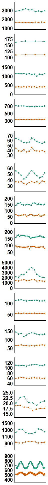
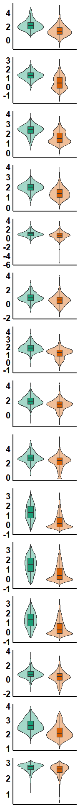
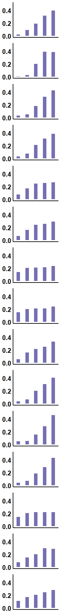
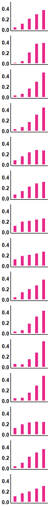
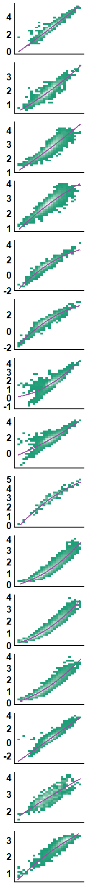
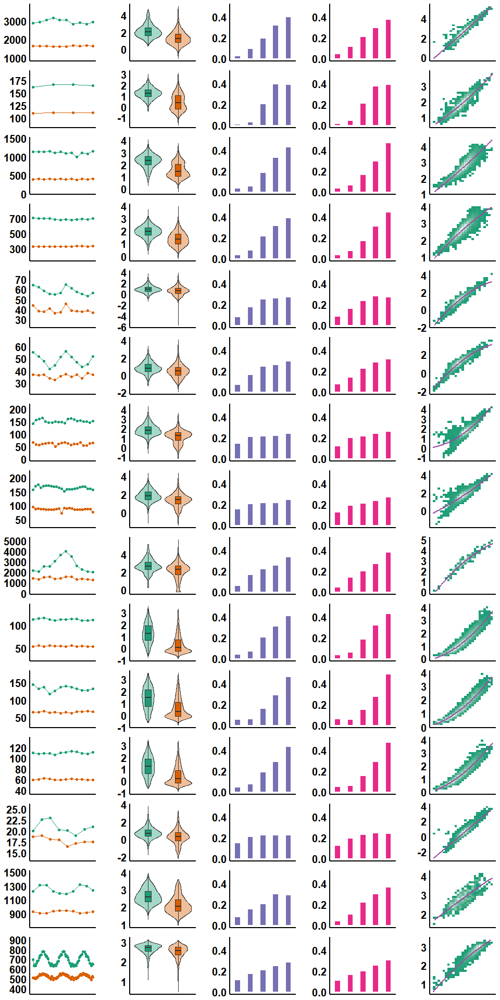

Figure3 markdown code and plot
================
Wanglab
2021.6.28

``` r
library(ggplot2)
library(ggpubr)
library(cowplot)
```

    ## 
    ## Attaching package: 'cowplot'

    ## The following object is masked from 'package:ggpubr':
    ## 
    ##     get_legend

``` r
library(RColorBrewer)
library("VennDiagram")
```

    ## Loading required package: grid

    ## Loading required package: futile.logger

    ## 
    ## Attaching package: 'VennDiagram'

    ## The following object is masked from 'package:ggpubr':
    ## 
    ##     rotate

``` r
library("ggeffects")
```

    ## 
    ## Attaching package: 'ggeffects'

    ## The following object is masked from 'package:cowplot':
    ## 
    ##     get_title

``` r
library("ggplot2")
library("cowplot")
library("ggplotify")
library(dplyr)
```

    ## 
    ## Attaching package: 'dplyr'

    ## The following objects are masked from 'package:stats':
    ## 
    ##     filter, lag

    ## The following objects are masked from 'package:base':
    ## 
    ##     intersect, setdiff, setequal, union

``` r
library(forcats)
library(hexbin)

arrangebycol = function(list1,...){
  nrowarr = length(list1)
  listall = c(list1,...)
  idorder = matrix(1:length(listall),nrow = nrowarr) %>% t() %>% as.vector()
  listall = listall[idorder]
  return(listall)
}
```

``` r
#draw first row of the plot


draw_exp_range_lineplot <- function(exp_data_name, range1, range2, exp_plot_name, range_plot_name, heatmap_plot_name)
{
  #exp_data_name: name of expression file
  #range1: start column number of expression data
  #range2: end column number of expression data
  #exp_plot_name: output file name
  #range_plot_name: output file name
  #heatmap_plot_name: output file name
  
  #compare between expression of cycling gene and non-cycling gene
  tmp = read.csv(exp_data_name)
  expr_tmp = tmp
  rownames(expr_tmp) = tmp$CycID
  expr_tmp = expr_tmp[,range1:range2]
  expr_tmp = as.matrix(expr_tmp)
  id_tmp = rowSums(expr_tmp<=0, na.rm = TRUE)==0
  tmp = tmp[id_tmp,]
  expr_mouse = tmp
  rownames(expr_mouse) = tmp$CycID
  expr_mouse = expr_mouse[,range1:range2]
  expr_mouse = as.matrix(expr_mouse)
  # expr_mouse = log10(expr_mouse)
  id_BoolCirOrderedMouse = tmp$meta2d_BH.Q<0.05
  # id_BoolCirOrderedMouse = tmp$JTK_BH.Q<0.05
  circ_exp <- expr_mouse[id_BoolCirOrderedMouse,]
  non_circ_exp <- expr_mouse[!id_BoolCirOrderedMouse,]
  x_axis_name <- c()
  for(i in 1:(range2 - range1 + 1)){
    x_axis_name <- c(x_axis_name, strsplit(colnames(circ_exp)[i], "X")[[1]][2])
  }
  cir_input <- rowMeans(circ_exp)
  non_cir_input <- rowMeans(non_circ_exp)

  circ_exp_mean <- c()
  circ_exp_sd <- c()
  non_circ_exp_mean <- c()
  non_circ_exp_sd <- c()
  for(i in 1:ncol(circ_exp)){
    circ_exp_mean[i] <- mean(circ_exp[,i])
    circ_exp_sd[i] <- sd(circ_exp[,i])
    non_circ_exp_mean[i] <- mean(non_circ_exp[,i])
    non_circ_exp_sd[i] <- sd(non_circ_exp[,i])
  }
  dataset_list <- c(rep("Circidian", length(circ_exp_mean)), rep("Not circidian", length(non_circ_exp_mean)))
  input_plot_data <- data.frame(dataset_list, c(x_axis_name, x_axis_name), 
                                c(circ_exp_mean, non_circ_exp_mean),
                                c(circ_exp_sd, non_circ_exp_sd))
  colnames(input_plot_data) <- c("dataset","time","mean","sd")
  input_plot_data$time <- as.numeric(input_plot_data$time)

  p<-ggplot(input_plot_data,aes(x = time,y = (mean),color = dataset))+
  geom_line(size = 0.7)+geom_point(size = 1.5)+
  scale_y_continuous(expand = c(0.5,0))+

  theme_bw() + 

  theme(axis.text.y = element_text(size = 15, face = "bold"))+
  theme(panel.grid =element_blank()) +   
  theme(axis.text = element_blank()) +   
  theme(axis.ticks = element_blank()) +   
  theme(panel.border = element_blank()) +   
  theme(axis.line.x = element_line(size=1, colour = "black"))+    
  theme(axis.line.y = element_line(size=1, colour = "black"))+    
  labs(x=NULL, y=NULL)+
  theme(legend.position = 'none')+
  scale_color_brewer(palette = 'Dark2')


  plot_list1 <<- c(plot_list1, list(p))
}
```

``` r
plot_list1 = list()
# 1
draw_exp_range_lineplot('ContainedData/Meta2dResult/AllSpecies/Human_blood_for_heatmap.csv',  19,28,"exp_boxplot_human_blood.pdf",
                        "range_boxplot_human_blood.pdf","pvalue_heatmap_human_blood.pdf")
draw_exp_range_lineplot('ContainedData/Meta2dResult/AllSpecies/Human_skin_for_heatmap.csv',  19,22,"exp_boxplot_human_skin.pdf",
                        "range_boxplot_human_skin.pdf","pvalue_heatmap_human_skin.pdf")

draw_exp_range_lineplot('ContainedData/Meta2dResult/AllSpecies/Mouse_LIV.csv',  24,35,"exp_boxplot_mouse_liver.pdf",
                        "range_boxplot_mouse_liver.pdf","pvalue_heatmap_mouse_liver.pdf")
draw_exp_range_lineplot('ContainedData/Meta2dResult/AllSpecies/Mouse_KID.csv',  24,35,"exp_boxplot_mouse_kidney.pdf",
                        "range_boxplot_mouse_kidney.pdf","pvalue_heatmap_mouse_kidney.pdf")


draw_exp_range_lineplot('ContainedData/Meta2dResult/AllSpecies/Fly_old.csv',  24,35,"exp_boxplot_fly_old.pdf",
                        "range_boxplot_fly_old.pdf","pvalue_heatmap_fly_old.pdf")
draw_exp_range_lineplot('ContainedData/Meta2dResult/AllSpecies/Fly_young.csv',  24,35,"exp_boxplot_fly_young.pdf",
                        "range_boxplot_fly_young.pdf","pvalue_heatmap_fly_young.pdf")


draw_exp_range_lineplot('ContainedData/Meta2dResult/AllSpecies/Yeast_high.csv',  24,43,"exp_boxplot_yeast_high.pdf",
                        "range_boxplot_yeast_high.pdf","pvalue_heatmap_yeast_high.pdf")
draw_exp_range_lineplot('ContainedData/Meta2dResult/AllSpecies/Yeast_low.csv',  24,47,"exp_boxplot_yeast_low.pdf",
                        "range_boxplot_yeast_low.pdf","pvalue_heatmap_yeast_low.pdf")

draw_exp_range_lineplot('ContainedData/Meta2dResult/AllSpecies/Neurospora.csv',  24,35,"exp_boxplot_neurospora.pdf",
                        "range_boxplot_neurospora.pdf","pvalue_heatmap_neurospora.pdf")


draw_exp_range_lineplot('ContainedData/Meta2dResult/AllSpecies/Arabidopsis_SD LEAF.csv',  24,35,"exp_boxplot_arabidopsis_Sd leaf.pdf",
                        "range_boxplot_arabidopsis_sd leaf.pdf","pvalue_heatmap_arabidopsis_sd leaf.pdf")
draw_exp_range_lineplot('ContainedData/Meta2dResult/AllSpecies/Arabidopsis_SD M.csv',  24,35,"exp_boxplot_arabidopsis_sd m.pdf",
                        "range_boxplot_arabidopsis_sd m.pdf","pvalue_heatmap_arabidopsis_sd m.pdf")
draw_exp_range_lineplot('ContainedData/Meta2dResult/AllSpecies/Arabidopsis_SD VA.csv',  24,35,"exp_boxplot_arabidopsis_sd va.pdf",
                        "range_boxplot_arabidopsis_sd va.pdf","pvalue_heatmap_arabidopsis_sd va.pdf")


draw_exp_range_lineplot('ContainedData/Meta2dResult/AllSpecies/Chlamydomounas_for_heatmap.csv',  19,26,"exp_boxplot_chlam.pdf",
                        "range_boxplot_chlam.pdf","pvalue_heatmap_chlam.pdf")

draw_exp_range_lineplot('ContainedData/Meta2dResult/AllSpecies/Cyanobacteria_for_heatmap.csv',  19,28,"exp_boxplot_cyano.pdf",
                        "range_boxplot_cyano.pdf","pvalue_heatmap_cyano.pdf")

draw_exp_range_lineplot('ContainedData/Meta2dResult/AllSpecies/Simulation.csv',  24,95,"exp_boxplot_simulation.pdf",
                        "range_boxplot_simulation.pdf","pvalue_heatmap_simulation.pdf")
```

``` r
ggarrange(plotlist = plot_list1,nrow=15,ncol = 1,align = 'v')
```

<!-- -->

``` r
#draw second row of the plot


draw_exp_range_boxplot <- function(exp_data_name, range1, range2, exp_plot_name, range_plot_name, heatmap_plot_name)
{
  #exp_data_name: name of expression file
  #range1: start column number of expression data
  #range2: end column number of expression data
  #exp_plot_name: output file name
  #range_plot_name: output file name
  #heatmap_plot_name: output file name
  
  #compare between expression of cycling gene and non-cycling gene
  tmp = read.csv(exp_data_name)
  expr_tmp = tmp
  rownames(expr_tmp) = tmp$CycID
  expr_tmp = expr_tmp[,range1:range2]
  expr_tmp = as.matrix(expr_tmp)
  id_tmp = rowSums(expr_tmp<=0)==0
  tmp = tmp[id_tmp,]
  expr_mouse = tmp
  rownames(expr_mouse) = tmp$CycID
  expr_mouse = expr_mouse[,range1:range2]
  expr_mouse = as.matrix(expr_mouse)
  # expr_mouse = log10(expr_mouse)
  id_BoolCirOrderedMouse = tmp$meta2d_BH.Q<0.05
  circ_exp <- expr_mouse[id_BoolCirOrderedMouse,]
  non_circ_exp <- expr_mouse[!id_BoolCirOrderedMouse,]
  x_axis_name <- c()
  for(i in 1:(range2 - range1 + 1)){
    x_axis_name <- c(x_axis_name, strsplit(colnames(circ_exp)[i], "X")[[1]][2])
  }
  cir_input <- rowMeans(circ_exp)
  non_cir_input <- rowMeans(non_circ_exp)
  

 #compare between range of cycling gene and non-cycling gene
  cir_input <- apply(circ_exp,1, function(x){return(max(x) - min(x))})
  non_cir_input <- apply(non_circ_exp,1, function(x){return(max(x) - min(x))})
  cir_input_new <- as.numeric(cir_input)
  non_cir_input_new <- as.numeric(non_cir_input)
  data <- data.frame(c(cir_input_new, non_cir_input_new), 
                     c(rep("Circidian", length(cir_input_new)), rep("Not circidian", length(non_cir_input_new))))
  colnames(data) <- c("Expression", "Group")
  print(t.test(cir_input_new, non_cir_input_new))
  print(wilcox.test(cir_input_new, non_cir_input_new))
  ylim1 = boxplot.stats(log10(data$Expression))$stats[c(1, 5)]

  
  p_new <- ggplot(data, aes(x=Group, y=log10(Expression)))+

    geom_violin(aes(fill = Group),alpha= 0.4) +
    geom_boxplot(width=.2,aes(fill = Group),outlier.shape = NA)+

    theme_bw() + 
    theme(axis.text.y = element_text(size = 15, face = "bold"))+
    theme(panel.grid =element_blank()) +   
    theme(axis.text = element_blank()) +   
    theme(axis.ticks = element_blank()) +   
    theme(panel.border = element_blank()) +   
    theme(axis.line.x = element_line(size=1, colour = "black"))+    
    theme(axis.line.y = element_line(size=1, colour = "black"))+    
    labs(x=NULL, y=NULL)+
    # coord_cartesian(ylim = ylim1*1.1)+
    # scale_y_continuous(breaks = c(-2:4))+
    theme(legend.position = 'none')+
    scale_color_brewer(palette = 'Dark2')+
    scale_fill_brewer(palette = 'Dark2')
   

  plot_list2 <<- c(plot_list2, list(p_new))
}
```

``` r
plot_list2 = list()

# 2
draw_exp_range_boxplot('ContainedData/Meta2dResult/AllSpecies/Human_blood_for_heatmap.csv',  19,28,"exp_boxplot_human_blood.pdf",
                        "range_boxplot_human_blood.pdf","pvalue_heatmap_human_blood.pdf")
```

    ## 
    ##  Welch Two Sample t-test
    ## 
    ## data:  cir_input_new and non_cir_input_new
    ## t = 7.7363, df = 2269.9, p-value = 1.528e-14
    ## alternative hypothesis: true difference in means is not equal to 0
    ## 95 percent confidence interval:
    ##  491.0739 824.5629
    ## sample estimates:
    ## mean of x mean of y 
    ##  971.1590  313.3406 
    ## 
    ## 
    ##  Wilcoxon rank sum test with continuity correction
    ## 
    ## data:  cir_input_new and non_cir_input_new
    ## W = 23263224, p-value < 2.2e-16
    ## alternative hypothesis: true location shift is not equal to 0

``` r
draw_exp_range_boxplot('ContainedData/Meta2dResult/AllSpecies/Human_skin_for_heatmap.csv',  19,22,"exp_boxplot_human_skin.pdf",
                        "range_boxplot_human_skin.pdf","pvalue_heatmap_human_skin.pdf")
```

    ## 
    ##  Welch Two Sample t-test
    ## 
    ## data:  cir_input_new and non_cir_input_new
    ## t = 10.259, df = 1150.5, p-value < 2.2e-16
    ## alternative hypothesis: true difference in means is not equal to 0
    ## 95 percent confidence interval:
    ##  17.52685 25.81619
    ## sample estimates:
    ## mean of x mean of y 
    ##  35.33229  13.66077 
    ## 
    ## 
    ##  Wilcoxon rank sum test with continuity correction
    ## 
    ## data:  cir_input_new and non_cir_input_new
    ## W = 13818674, p-value < 2.2e-16
    ## alternative hypothesis: true location shift is not equal to 0

``` r
draw_exp_range_boxplot('ContainedData/Meta2dResult/AllSpecies/Mouse_LIV.csv',  24,35,"exp_boxplot_mouse_liver.pdf",
                        "range_boxplot_mouse_liver.pdf","pvalue_heatmap_mouse_liver.pdf")
```

    ## 
    ##  Welch Two Sample t-test
    ## 
    ## data:  cir_input_new and non_cir_input_new
    ## t = 36.057, df = 5783.9, p-value < 2.2e-16
    ## alternative hypothesis: true difference in means is not equal to 0
    ## 95 percent confidence interval:
    ##  264.8904 295.3496
    ## sample estimates:
    ## mean of x mean of y 
    ##  383.2329  103.1129 
    ## 
    ## 
    ##  Wilcoxon rank sum test with continuity correction
    ## 
    ## data:  cir_input_new and non_cir_input_new
    ## W = 61291496, p-value < 2.2e-16
    ## alternative hypothesis: true location shift is not equal to 0

``` r
draw_exp_range_boxplot('ContainedData/Meta2dResult/AllSpecies/Mouse_KID.csv',  24,35,"exp_boxplot_mouse_kidney.pdf",
                        "range_boxplot_mouse_kidney.pdf","pvalue_heatmap_mouse_kidney.pdf")
```

    ## 
    ##  Welch Two Sample t-test
    ## 
    ## data:  cir_input_new and non_cir_input_new
    ## t = 31.627, df = 6415.5, p-value < 2.2e-16
    ## alternative hypothesis: true difference in means is not equal to 0
    ## 95 percent confidence interval:
    ##   91.9711 104.1258
    ## sample estimates:
    ## mean of x mean of y 
    ## 153.70765  55.65919 
    ## 
    ## 
    ##  Wilcoxon rank sum test with continuity correction
    ## 
    ## data:  cir_input_new and non_cir_input_new
    ## W = 58786117, p-value < 2.2e-16
    ## alternative hypothesis: true location shift is not equal to 0

``` r
draw_exp_range_boxplot('ContainedData/Meta2dResult/AllSpecies/Fly_old.csv',  24,35,"exp_boxplot_fly_old.pdf",
                        "range_boxplot_fly_old.pdf","pvalue_heatmap_fly_old.pdf")
```

    ## 
    ##  Welch Two Sample t-test
    ## 
    ## data:  cir_input_new and non_cir_input_new
    ## t = 1.3352, df = 2591.3, p-value = 0.1819
    ## alternative hypothesis: true difference in means is not equal to 0
    ## 95 percent confidence interval:
    ##  -2.953021 15.557553
    ## sample estimates:
    ## mean of x mean of y 
    ##  33.17124  26.86898 
    ## 
    ## 
    ##  Wilcoxon rank sum test with continuity correction
    ## 
    ## data:  cir_input_new and non_cir_input_new
    ## W = 7751132, p-value < 2.2e-16
    ## alternative hypothesis: true location shift is not equal to 0

``` r
draw_exp_range_boxplot('ContainedData/Meta2dResult/AllSpecies/Fly_young.csv',  24,35,"exp_boxplot_fly_young.pdf",
                        "range_boxplot_fly_young.pdf","pvalue_heatmap_fly_young.pdf")
```

    ## 
    ##  Welch Two Sample t-test
    ## 
    ## data:  cir_input_new and non_cir_input_new
    ## t = 1.4361, df = 5947.1, p-value = 0.151
    ## alternative hypothesis: true difference in means is not equal to 0
    ## 95 percent confidence interval:
    ##  -1.687509 10.933019
    ## sample estimates:
    ## mean of x mean of y 
    ##  28.09915  23.47640 
    ## 
    ## 
    ##  Wilcoxon rank sum test with continuity correction
    ## 
    ## data:  cir_input_new and non_cir_input_new
    ## W = 8307909, p-value < 2.2e-16
    ## alternative hypothesis: true location shift is not equal to 0

``` r
draw_exp_range_boxplot('ContainedData/Meta2dResult/AllSpecies/Yeast_high.csv',  24,43,"exp_boxplot_yeast_high.pdf",
                        "range_boxplot_yeast_high.pdf","pvalue_heatmap_yeast_high.pdf")
```

    ## 
    ##  Welch Two Sample t-test
    ## 
    ## data:  cir_input_new and non_cir_input_new
    ## t = 12.51, df = 5791.6, p-value < 2.2e-16
    ## alternative hypothesis: true difference in means is not equal to 0
    ## 95 percent confidence interval:
    ##  142.1722 195.0099
    ## sample estimates:
    ## mean of x mean of y 
    ## 226.20204  57.61099 
    ## 
    ## 
    ##  Wilcoxon rank sum test with continuity correction
    ## 
    ## data:  cir_input_new and non_cir_input_new
    ## W = 4501016, p-value < 2.2e-16
    ## alternative hypothesis: true location shift is not equal to 0

``` r
draw_exp_range_boxplot('ContainedData/Meta2dResult/AllSpecies/Yeast_low.csv',  24,47,"exp_boxplot_yeast_low.pdf",
                        "range_boxplot_yeast_low.pdf","pvalue_heatmap_yeast_low.pdf")
```

    ## 
    ##  Welch Two Sample t-test
    ## 
    ## data:  cir_input_new and non_cir_input_new
    ## t = 7.9182, df = 5742.9, p-value = 2.872e-15
    ## alternative hypothesis: true difference in means is not equal to 0
    ## 95 percent confidence interval:
    ##  118.6410 196.7174
    ## sample estimates:
    ## mean of x mean of y 
    ##  260.5675  102.8883 
    ## 
    ## 
    ##  Wilcoxon rank sum test with continuity correction
    ## 
    ## data:  cir_input_new and non_cir_input_new
    ## W = 5226945, p-value < 2.2e-16
    ## alternative hypothesis: true location shift is not equal to 0

``` r
draw_exp_range_boxplot('ContainedData/Meta2dResult/AllSpecies/Neurospora.csv',  24,35,"exp_boxplot_neurospora.pdf",
                        "range_boxplot_neurospora.pdf","pvalue_heatmap_neurospora.pdf")
```

    ## 
    ##  Welch Two Sample t-test
    ## 
    ## data:  cir_input_new and non_cir_input_new
    ## t = 2.1456, df = 175.36, p-value = 0.03328
    ## alternative hypothesis: true difference in means is not equal to 0
    ## 95 percent confidence interval:
    ##   176.5393 4226.3957
    ## sample estimates:
    ## mean of x mean of y 
    ##  3263.350  1061.883 
    ## 
    ## 
    ##  Wilcoxon rank sum test with continuity correction
    ## 
    ## data:  cir_input_new and non_cir_input_new
    ## W = 1113639, p-value = 4.978e-15
    ## alternative hypothesis: true location shift is not equal to 0

``` r
draw_exp_range_boxplot('ContainedData/Meta2dResult/AllSpecies/Arabidopsis_SD LEAF.csv',  24,35,"exp_boxplot_arabidopsis_Sd leaf.pdf",
                        "range_boxplot_arabidopsis_sd leaf.pdf","pvalue_heatmap_arabidopsis_sd leaf.pdf")
```

    ## 
    ##  Welch Two Sample t-test
    ## 
    ## data:  cir_input_new and non_cir_input_new
    ## t = 23.438, df = 6786, p-value < 2.2e-16
    ## alternative hypothesis: true difference in means is not equal to 0
    ## 95 percent confidence interval:
    ##  70.81164 83.73770
    ## sample estimates:
    ## mean of x mean of y 
    ##  98.61732  21.34265 
    ## 
    ## 
    ##  Wilcoxon rank sum test with continuity correction
    ## 
    ## data:  cir_input_new and non_cir_input_new
    ## W = 67223242, p-value < 2.2e-16
    ## alternative hypothesis: true location shift is not equal to 0

``` r
draw_exp_range_boxplot('ContainedData/Meta2dResult/AllSpecies/Arabidopsis_SD M.csv',  24,35,"exp_boxplot_arabidopsis_sd m.pdf",
                        "range_boxplot_arabidopsis_sd m.pdf","pvalue_heatmap_arabidopsis_sd m.pdf")
```

    ## 
    ##  Welch Two Sample t-test
    ## 
    ## data:  cir_input_new and non_cir_input_new
    ## t = 16.966, df = 2724.2, p-value < 2.2e-16
    ## alternative hypothesis: true difference in means is not equal to 0
    ## 95 percent confidence interval:
    ##   93.59926 118.06166
    ## sample estimates:
    ## mean of x mean of y 
    ## 143.71647  37.88601 
    ## 
    ## 
    ##  Wilcoxon rank sum test with continuity correction
    ## 
    ## data:  cir_input_new and non_cir_input_new
    ## W = 33822768, p-value < 2.2e-16
    ## alternative hypothesis: true location shift is not equal to 0

``` r
draw_exp_range_boxplot('ContainedData/Meta2dResult/AllSpecies/Arabidopsis_SD VA.csv',  24,35,"exp_boxplot_arabidopsis_sd va.pdf",
                        "range_boxplot_arabidopsis_sd va.pdf","pvalue_heatmap_arabidopsis_sd va.pdf")
```

    ## 
    ##  Welch Two Sample t-test
    ## 
    ## data:  cir_input_new and non_cir_input_new
    ## t = 15.697, df = 3165.6, p-value < 2.2e-16
    ## alternative hypothesis: true difference in means is not equal to 0
    ## 95 percent confidence interval:
    ##  54.47926 70.03242
    ## sample estimates:
    ## mean of x mean of y 
    ##  86.07343  23.81759 
    ## 
    ## 
    ##  Wilcoxon rank sum test with continuity correction
    ## 
    ## data:  cir_input_new and non_cir_input_new
    ## W = 38171019, p-value < 2.2e-16
    ## alternative hypothesis: true location shift is not equal to 0

``` r
draw_exp_range_boxplot('ContainedData/Meta2dResult/AllSpecies/Chlamydomounas_for_heatmap.csv',  19,26,"exp_boxplot_chlam.pdf",
                        "range_boxplot_chlam.pdf","pvalue_heatmap_chlam.pdf")
```

    ## 
    ##  Welch Two Sample t-test
    ## 
    ## data:  cir_input_new and non_cir_input_new
    ## t = 5.6049, df = 15588, p-value = 2.119e-08
    ## alternative hypothesis: true difference in means is not equal to 0
    ## 95 percent confidence interval:
    ##   6.403263 13.290416
    ## sample estimates:
    ## mean of x mean of y 
    ##  25.39718  15.55034 
    ## 
    ## 
    ##  Wilcoxon rank sum test with continuity correction
    ## 
    ## data:  cir_input_new and non_cir_input_new
    ## W = 36946410, p-value < 2.2e-16
    ## alternative hypothesis: true location shift is not equal to 0

``` r
draw_exp_range_boxplot('ContainedData/Meta2dResult/AllSpecies/Cyanobacteria_for_heatmap.csv',  19,28,"exp_boxplot_cyano.pdf",
                        "range_boxplot_cyano.pdf","pvalue_heatmap_cyano.pdf")
```

    ## 
    ##  Welch Two Sample t-test
    ## 
    ## data:  cir_input_new and non_cir_input_new
    ## t = 10.857, df = 674.67, p-value < 2.2e-16
    ## alternative hypothesis: true difference in means is not equal to 0
    ## 95 percent confidence interval:
    ##  350.3726 505.0773
    ## sample estimates:
    ## mean of x mean of y 
    ##  718.7705  291.0455 
    ## 
    ## 
    ##  Wilcoxon rank sum test with continuity correction
    ## 
    ## data:  cir_input_new and non_cir_input_new
    ## W = 859311, p-value < 2.2e-16
    ## alternative hypothesis: true location shift is not equal to 0

``` r
draw_exp_range_boxplot('ContainedData/Meta2dResult/AllSpecies/Simulation.csv',  24,95,"exp_boxplot_simulation.pdf",
                        "range_boxplot_simulation.pdf","pvalue_heatmap_simulation.pdf")
```

    ## 
    ##  Welch Two Sample t-test
    ## 
    ## data:  cir_input_new and non_cir_input_new
    ## t = 20.072, df = 5788.5, p-value < 2.2e-16
    ## alternative hypothesis: true difference in means is not equal to 0
    ## 95 percent confidence interval:
    ##   97.73645 118.89371
    ## sample estimates:
    ## mean of x mean of y 
    ##  543.3038  434.9887 
    ## 
    ## 
    ##  Wilcoxon rank sum test with continuity correction
    ## 
    ## data:  cir_input_new and non_cir_input_new
    ## W = 13408519, p-value < 2.2e-16
    ## alternative hypothesis: true location shift is not equal to 0

``` r
# 
ggarrange(plotlist = plot_list2,nrow=15,ncol = 1,align = 'v')
```

<!-- -->

``` r
#expression percentage
draw_expression_percentage_plot <- function(exp_data_name, range1, range2, plot_name, plot_title){
  #exp_data_name: name of expression file
  #range1: start column number of expression data
  #range2: end column number of expression data
  #plot_name: output file name
  #plot_title: title of plot
  
  mouse_data <- read.csv(exp_data_name)
  name <- as.character(mouse_data[mouse_data$meta2d_BH.Q < 0.05,1])
  max_min_data <- c()
  mean_data <- c()
  tmp = mouse_data[,range1:range2]
  max_min_data = apply(tmp, 1, function(x){max(x) - min(x)})
  mean_data = apply(tmp, 1, function(x){mean(as.numeric(x))})
  
  
  plot_data <- data.frame(mouse_data$CycID, max_min_data, mean_data,0)
  colnames(plot_data) <- c("name","max_min","mean","type")
  plot_data[plot_data$name %in% name,]$type <- 1
  plot_data$max_min <- log(plot_data$max_min)
  plot_data$mean <- log(plot_data$mean)
  plot_data <- data.frame(mouse_data$CycID, mean_data,max_min_data,0)
  name <- mouse_data[mouse_data$meta2d_BH.Q < 0.05,]$CycID
  colnames(plot_data) <- c("name","mean exp","range","type")
  plot_data[plot_data$name %in% name,]$type <- 1
  equ <- glm(plot_data$type ~plot_data$`mean exp`+ plot_data$`range`)
  # coefficient <- rbind(coefficient, equ$coefficients)
  
  aa= matrix(-1,nrow = 1,ncol = 5)
  rownames(aa)="Liver"
  colnames(aa)= c('level1','level2','level3','level4','level5')
  bb= aa
  diffpvalue=matrix(-1,nrow = 1,ncol = 4)
  rownames(diffpvalue)=plot_name
  colnames(diffpvalue)=c('diff12','diff23','diff34','diff45')
  set.seed(1)
  
  expr = mouse_data
  
  bhp= expr[,'meta2d_BH.Q']
  bhp= bhp[order(mean_data)]
  smallp= bhp<0.05
  len = length(smallp)
  n=5
  i = 1
  quantilepoint= apply(as.matrix(1:n),1,function(x)floor(len/n*x))
  quantilepoint= cbind(c(0,quantilepoint[1:(n-1)])+1,quantilepoint)
  prop= apply(quantilepoint,1,function(x)mean(smallp[x[1]:x[2]]))
  aa[i,]=prop
  
  numb= apply(quantilepoint,1,function(x)sum(smallp[x[1]:x[2]]))
  bb[i,]=numb
  #cat(tissuename[i],'   ',bb[i,],'\n')
  bbdiff=c(bb[i,2]-bb[i,1],bb[i,3]-bb[i,2],bb[i,4]-bb[i,3],bb[i,5]-bb[i,4])

  
  aa= aa/rowSums(aa)
  
  aan= as.numeric(aa[i,])
  groupaan1 = c("0-20%","20-40%","40-60%","60-80%","80-100%")
  aan1 <- data.frame(aan, groupaan1)
  colnames(aan1) <- c("data","group")

  
  colcol = brewer.pal(n = 3,name = 'Dark2')[3]
  
   a <- ggplot(aan1, aes(x=group, y=data)) +
     geom_bar(fill = colcol,stat = 'identity',width = 0.4
              )+

    theme_bw() + 
    # theme(axis.text.x = element_text(size = 15, face = "bold"))+
    theme(axis.text.y = element_text(size = 15, face = "bold"))+
    theme(panel.grid =element_blank()) +   
    theme(axis.text = element_blank()) +   
    theme(axis.ticks = element_blank()) +   
    theme(panel.border = element_blank()) +   
    theme(axis.line.y= element_line(size=1, colour = "black"))+    
    theme(axis.line.x= element_line(size=1, colour = "black"))+    
    labs(x=NULL, y=NULL)+
    scale_y_continuous(limits = c(0,0.5),breaks = c(0,0.2,0.4))+
    # coord_flip()+
    theme(legend.position = 'none')
   
    plot_list3 <<- c(plot_list3, list(a))
}
```

``` r
plot_list3 = list()

# 3
draw_expression_percentage_plot('ContainedData/Meta2dResult/AllSpecies/Human_blood.csv',  19,233,"expression_expression_human_blood.pdf",
                                "Human blood")
draw_expression_percentage_plot('ContainedData/Meta2dResult/AllSpecies/Human_skin.csv',  19,94,"expression_expression_human_skin.pdf",
                                "Human skin")

draw_expression_percentage_plot('ContainedData/Meta2dResult/AllSpecies/Mouse_LIV.csv',  24,35,"expression_expression_mouse_liver.pdf", "Mouse liver")
draw_expression_percentage_plot('ContainedData/Meta2dResult/AllSpecies/Mouse_KID.csv',  24,35,"expression_expression_mouse_kidney.pdf",
                                "Mouse kidney")


draw_expression_percentage_plot('ContainedData/Meta2dResult/AllSpecies/Fly_old.csv',  24,35,"expression_expression_fly_old.pdf",
                                "Fly old")
draw_expression_percentage_plot('ContainedData/Meta2dResult/AllSpecies/Fly_young.csv',  24,35,"expression_expression_fly_young.pdf",
                                "Fly young")


draw_expression_percentage_plot('ContainedData/Meta2dResult/AllSpecies/Yeast_high.csv',  24,43,"expression_expression_yeast_high.pdf",
                                "Yeast high")
draw_expression_percentage_plot('ContainedData/Meta2dResult/AllSpecies/Yeast_low.csv',  24,47,"expression_expression_yeast_low.pdf",
                                "Yeast low")

draw_expression_percentage_plot('ContainedData/Meta2dResult/AllSpecies/Neurospora.csv',  24,35,"expression_expression_neurospora.pdf",
                                "Neurospora")

draw_expression_percentage_plot('ContainedData/Meta2dResult/AllSpecies/Arabidopsis_SD LEAF.csv',  24,35,"expression_expression_arabidopsis_sd leaf.pdf",
                                "Arabidopsis sd leaf")
draw_expression_percentage_plot('ContainedData/Meta2dResult/AllSpecies/Arabidopsis_SD M.csv',  24,35,"expression_expression_arabidopsis_sd m.pdf",
                                "Arabidopsis sd m")
draw_expression_percentage_plot('ContainedData/Meta2dResult/AllSpecies/Arabidopsis_SD VA.csv',  24,35,"expression_expression_arabidopsis_sd va.pdf",
                                "Arabidopsis sd va")


draw_expression_percentage_plot('ContainedData/Meta2dResult/AllSpecies/Chlamydomounas.csv',  19,34,"expression_expression_chlam.pdf",
                                "Green alga")

draw_expression_percentage_plot('ContainedData/Meta2dResult/AllSpecies/Cyanobacteria.csv',  19,38,"expression_expression_cyano.pdf",
                                "Cyanobacteria")
draw_expression_percentage_plot('ContainedData/Meta2dResult/AllSpecies/Simulation.csv',  24,95,"expression_expression_simulation.pdf",
                                "Simulation")
```

``` r
ggarrange(plotlist = plot_list3,nrow=15,ncol = 1,align = 'v')
```

<!-- -->

``` r
# 4
#range percentage
draw_range_percentage_plot <- function(exp_data_name, range1, range2, plot_name, plot_title){
  #exp_data_name: name of expression file
  #range1: start column number of expression data
  #range2: end column number of expression data
  #plot_name: output file name
  #plot_title: title of plot
  
  mouse_data <- read.csv(exp_data_name)
  name <- as.character(mouse_data[mouse_data$meta2d_BH.Q < 0.05,1])
  max_min_data <- c()
  mean_data <- c()

  tmp = mouse_data[,range1:range2]
  max_min_data = apply(tmp, 1, function(x){max(x) - min(x)})
  mean_data = apply(tmp, 1, function(x){mean(as.numeric(x))})
  
  plot_data <- data.frame(mouse_data$CycID, max_min_data, mean_data,0)
  colnames(plot_data) <- c("name","max_min","mean","type")
  plot_data[plot_data$name %in% name,]$type <- 1
  plot_data$max_min <- log(plot_data$max_min)
  plot_data$mean <- log(plot_data$mean)
  
  plot_data <- data.frame(mouse_data$CycID, mean_data,max_min_data,0)
  name <- mouse_data[mouse_data$meta2d_BH.Q < 0.05,]$CycID
  colnames(plot_data) <- c("name","mean exp","range","type")
  plot_data[plot_data$name %in% name,]$type <- 1
  equ <- glm(plot_data$type ~plot_data$`mean exp`+ plot_data$`range`)
  # coefficient <- rbind(coefficient, equ$coefficients)
  
  aa= matrix(-1,nrow = 1,ncol = 5)
  rownames(aa)="Liver"
  colnames(aa)= c('level1','level2','level3','level4','level5')
  bb= aa
  diffpvalue=matrix(-1,nrow = 1,ncol = 4)
  rownames(diffpvalue)=plot_name
  colnames(diffpvalue)=c('diff12','diff23','diff34','diff45')
  set.seed(1)
  
  expr = mouse_data
  
  bhp= expr[,'meta2d_BH.Q']
  bhp= bhp[order(max_min_data)]
  smallp= bhp<0.05
  len = length(smallp)
  n=5
  i = 1
  quantilepoint= apply(as.matrix(1:n),1,function(x)floor(len/n*x))
  quantilepoint= cbind(c(0,quantilepoint[1:(n-1)])+1,quantilepoint)
  prop= apply(quantilepoint,1,function(x)mean(smallp[x[1]:x[2]]))
  aa[i,]=prop
  numb= apply(quantilepoint,1,function(x)sum(smallp[x[1]:x[2]]))
  bb[i,]=numb
  #cat(tissuename[i],'   ',bb[i,],'\n')
  bbdiff=c(bb[i,2]-bb[i,1],bb[i,3]-bb[i,2],bb[i,4]-bb[i,3],bb[i,5]-bb[i,4])

  
  aa= aa/rowSums(aa)
  aan= as.numeric(aa[i,])
  aan= as.numeric(aa[i,])
  groupaan2 = c("0-20%","20-40%","40-60%","60-80%","80-100%")
  aan2 <- data.frame(aan, groupaan2)
  colnames(aan2) <- c("data","group")
  # aan2$group = factor(aan2$group,levels = groupaan2[5:1])
  
  colcol = brewer.pal(n = 6,name = 'Dark2')[4]
  
   a2 <- ggplot(aan2, aes(x=group, y=data)) +
     geom_bar(fill = colcol,stat = 'identity',width = 0.4
              # ,alpha = c(2,4,6,8,10)/10
              )+

    theme_bw() + 
    # theme(axis.text.x = element_text(size = 15, face = "bold"))+
    theme(axis.text.y = element_text(size = 15, face = "bold"))+
    theme(panel.grid =element_blank()) + 
    theme(axis.text = element_blank()) +   
    theme(axis.ticks = element_blank()) +   
    theme(panel.border = element_blank()) +   
    theme(axis.line.y= element_line(size=1, colour = "black"))+    
    theme(axis.line.x= element_line(size=1, colour = "black"))+   
    labs(x=NULL, y=NULL)+
    scale_y_continuous(limits = c(0,0.5),breaks = c(0,0.2,0.4))+
    # coord_flip()+
    theme(legend.position = 'none')

  
  plot_list4 <<- c(plot_list4, list(a2))
}
```

``` r
plot_list4 = list()

# 4
draw_range_percentage_plot('ContainedData/Meta2dResult/AllSpecies/Human_blood.csv',  19,233,"range_expression_human_blood.pdf",
                           "Human blood")
draw_range_percentage_plot('ContainedData/Meta2dResult/AllSpecies/Human_skin.csv',  19,94,"range_expression_human_skin.pdf",
                           "Human skin")

draw_range_percentage_plot('ContainedData/Meta2dResult/AllSpecies/Mouse_LIV.csv',  24,35,"range_expression_mouse_liver.pdf", "Mouse liver")
draw_range_percentage_plot('ContainedData/Meta2dResult/AllSpecies/Mouse_KID.csv',  24,35,"range_expression_mouse_kidney.pdf",
                           "Mouse kidney")

draw_range_percentage_plot('ContainedData/Meta2dResult/AllSpecies/Fly_old.csv',  24,35,"range_expression_fly_old.pdf",
                           "Fly old")
draw_range_percentage_plot('ContainedData/Meta2dResult/AllSpecies/Fly_young.csv',  24,35,"range_expression_fly_young.pdf",
                           "Fly young")


draw_range_percentage_plot('ContainedData/Meta2dResult/AllSpecies/Yeast_high.csv',  24,43,"range_expression_yeast_high.pdf",
                           "Yeast high")
draw_range_percentage_plot('ContainedData/Meta2dResult/AllSpecies/Yeast_low.csv',  24,47,"range_expression_yeast_low.pdf",
                           "Yeast low")

draw_range_percentage_plot('ContainedData/Meta2dResult/AllSpecies/Neurospora.csv',  24,35,"range_expression_neurospora.pdf",
                           "Neurospora")

draw_range_percentage_plot('ContainedData/Meta2dResult/AllSpecies/Arabidopsis_SD LEAF.csv',  24,35,"range_expression_arabidopsis_sd leaf.pdf",
                           "Arabidopsis sd leaf")
draw_range_percentage_plot('ContainedData/Meta2dResult/AllSpecies/Arabidopsis_SD M.csv',  24,35,"range_expression_arabidopsis_sd m.pdf",
                           "Arabidopsis sd m")
draw_range_percentage_plot('ContainedData/Meta2dResult/AllSpecies/Arabidopsis_SD VA.csv',  24,35,"range_expression_arabidopsis_sd va.pdf",
                           "Arabidopsis sd va")


draw_range_percentage_plot('ContainedData/Meta2dResult/AllSpecies/Chlamydomounas.csv',  19,34,"range_expression_chlam.pdf",
                           "Green alga")

draw_range_percentage_plot('ContainedData/Meta2dResult/AllSpecies/Cyanobacteria.csv',  19,38,"range_expression_cyano.pdf",
                           "Cyanobacteria")

draw_range_percentage_plot('ContainedData/Meta2dResult/AllSpecies/Simulation.csv',  24,95,"range_expression_cyano.pdf",
                           "Simulation")
```

``` r
ggarrange(plotlist = plot_list4,nrow=15,ncol = 1,align = 'v')
```

<!-- -->

``` r
# 5
exp_data_name = 'ContainedData/Meta2dResult/AllSpecies/Human_blood.csv'
range1 = 19
range2 = 233
plot_name = 'amplitude_expression_human_blood.pdf'
plot_title =  "Human blood"

# 
draw_dotplot_exp_amp <- function(exp_data_name, range1, range2, plot_name, plot_title, now_color){
  #exp_data_name: name of expression file
  #range1: start column number of expression data
  #range2: end column number of expression data
  #plot_name: output file name
  #plot_title: title of plot
  #now_color: color of dot plot
  tissuename<- c(plot_title)
  aa= matrix(0,nrow = 1,ncol = 3)
  rownames(aa)= tissuename
  colnames(aa)= c('cor','pvalue','R2')
  aaa= matrix(0,nrow = 1,ncol = 2)
  expr = read.csv(exp_data_name)
  gene_data <- expr[expr$meta2d_BH.Q < 0.05,]
  #gene_data <- expr
  cir = gene_data$CycID
  expr_cir = expr[expr$CycID %in% cir,]
  expr_cir <- expr_cir[expr_cir[,'meta2d_AMP']!=0,]
  expr_cirmean= rowMeans(expr_cir[,range1:range2], na.rm = TRUE)
  aa[1,1]=cor.test(log10(as.numeric(expr_cirmean)),log10(as.numeric(expr_cir[,'meta2d_AMP'])))$estimate
  aa[1,2]=cor.test(log10(as.numeric(expr_cirmean)),log10(as.numeric(expr_cir[,'meta2d_AMP'])))$p.value
  aa[1,3]= aa[1,1]^2
  aaa[1,1]= aa[1,'R2']
  aaa[1,2]= 1- aa[1,'R2']
  i=1
  data <- data.frame(expr_cirmean, expr_cir[,'meta2d_AMP'])
  data <- data.frame(log10(expr_cirmean), log10(expr_cir[,'meta2d_AMP']))
  colnames(data) <- c("expression", "amplitude")

  
  colcol = brewer.pal(n = 3,name = 'Dark2')[1]
  colcolline = brewer.pal(n = 6,name = 'Set1')[4]

  print((cor.test(data$expression, data$amplitude)$estimate)^2)
     p5 <- ggplot(data, aes(x=amplitude, y=expression)) +
     # geom_point(size = 0.4,color = colcol)+
       geom_bin2d(bins = 24)+
       # geom_hex(bins = 15)+
       scale_fill_gradient(low = colcol,high = "#E8F5F1")+

     stat_smooth(method='lm',formula = y~x+ I(x^2),colour=colcolline,size = 1,se = F) +

    theme_bw() + 
    # theme(axis.text.x = element_text(size = 15, face = "bold"))+
    theme(axis.text.y = element_text(size = 15, face = "bold"))+
    theme(panel.grid =element_blank()) +   
    theme(axis.text = element_blank()) +   
    theme(axis.ticks = element_blank()) +  
    theme(panel.border = element_blank()) +   
    theme(axis.line.x= element_line(size=1, colour = "black"))+   
    theme(axis.line.y= element_line(size=1, colour = "black"))+   
    labs(x=NULL, y=NULL)+

    theme(legend.position = 'none')

  
  
  plot_list5 <<- c(plot_list5, list(p5))
}
```

``` r
plot_list5 = list()

# 5
draw_dotplot_exp_amp('ContainedData/Meta2dResult/AllSpecies/Human_blood.csv',  19,233,"amplitude_expression_human_blood.pdf",
                     "Human blood","#FC8D62")
```

    ##       cor 
    ## 0.9334137

``` r
draw_dotplot_exp_amp('ContainedData/Meta2dResult/AllSpecies/Human_skin.csv',  19,94,"amplitude_expression_human_skin.pdf",
                     "Human skin","#FC8D62")
```

    ##       cor 
    ## 0.8099745

``` r
draw_dotplot_exp_amp('ContainedData/Meta2dResult/AllSpecies/Mouse_LIV.csv',  24,35,"amplitude_expression_mouse_liver.pdf", "Mouse liver","#FC8D62")
```

    ##       cor 
    ## 0.8239072

``` r
draw_dotplot_exp_amp('ContainedData/Meta2dResult/AllSpecies/Mouse_KID.csv',  24,35,"amplitude_expression_mouse_kidney.pdf",
                     "Mouse kidney","#FC8D62")
```

    ##       cor 
    ## 0.8154836

``` r
draw_dotplot_exp_amp('ContainedData/Meta2dResult/AllSpecies/Fly_old.csv',  24,35,"amplitude_expression_fly_old.pdf",
                     "Fly old","#FC8D62")
```

    ##       cor 
    ## 0.8839659

``` r
draw_dotplot_exp_amp('ContainedData/Meta2dResult/AllSpecies/Fly_young.csv',  24,35,"amplitude_expression_fly_young.pdf",
                     "Fly young","#FC8D62")
```

    ##       cor 
    ## 0.8834392

``` r
draw_dotplot_exp_amp('ContainedData/Meta2dResult/AllSpecies/Yeast_high.csv',  24,43,"amplitude_expression_yeast_high.pdf",
                     "Yeast high","#FC8D62")
```

    ##       cor 
    ## 0.7263861

``` r
draw_dotplot_exp_amp('ContainedData/Meta2dResult/AllSpecies/Yeast_low.csv',  24,47,"amplitude_expression_yeast_low.pdf",
                     "Yeast low","#FC8D62")
```

    ##       cor 
    ## 0.7292183

``` r
draw_dotplot_exp_amp('ContainedData/Meta2dResult/AllSpecies/Neurospora.csv',  24,35,"amplitude_expression_neurospora.pdf",
                     "Neurospora","#FC8D62")
```

    ##     cor 
    ## 0.91526

``` r
draw_dotplot_exp_amp('ContainedData/Meta2dResult/AllSpecies/Arabidopsis_SD LEAF.csv',  24,35,"amplitude_expression_arabidopsis_sd leaf.pdf",
                     "Arabidopsis sd leaf","#FC8D62")
```

    ##       cor 
    ## 0.9010238

``` r
draw_dotplot_exp_amp('ContainedData/Meta2dResult/AllSpecies/Arabidopsis_SD M.csv',  24,35,"amplitude_expression_arabidopsis_sd m.pdf",
                     "Arabidopsis sd m","#FC8D62")
```

    ##       cor 
    ## 0.9197196

``` r
draw_dotplot_exp_amp('ContainedData/Meta2dResult/AllSpecies/Arabidopsis_SD VA.csv',  24,35,"amplitude_expression_arabidopsis_sd va.pdf",
                     "Arabidopsis sd va","#FC8D62")
```

    ##       cor 
    ## 0.9012845

``` r
draw_dotplot_exp_amp('ContainedData/Meta2dResult/AllSpecies/Chlamydomounas.csv',  19,34,"amplitude_expression_chlam.pdf",
                     "Green alga","#FC8D62")
```

    ##       cor 
    ## 0.8584871

``` r
draw_dotplot_exp_amp('ContainedData/Meta2dResult/AllSpecies/Cyanobacteria.csv',  19,38,"amplitude_expression_cyano.pdf",
                     "Cyanobacteria","#FC8D62")
```

    ##       cor 
    ## 0.6680911

``` r
draw_dotplot_exp_amp('ContainedData/Meta2dResult/AllSpecies/Simulation.csv',  24,95,"amplitude_expression_cyano.pdf",
                     "Simulation","#FC8D62")
```

    ##       cor 
    ## 0.8723273

``` r
# temp_plot <- plot_grid(plotlist = plot_list[61:75],nrow=15, ncol=1, axis="bl",rel_widths=c(1,1,1))
# temp_plot
ggarrange(plotlist = plot_list5,nrow=15,ncol = 1,align = 'v')
```

<!-- -->

``` r
ggarrange(plotlist = arrangebycol(plot_list1,plot_list2,plot_list3,plot_list4,plot_list5),
          nrow=15,ncol = 5,align = 'v')
```

<!-- -->
