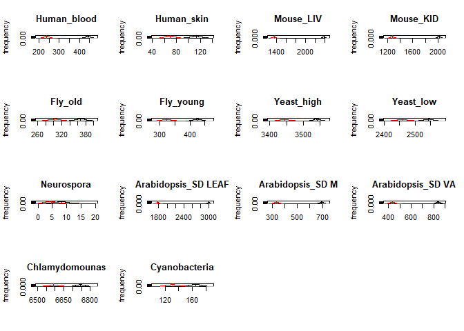
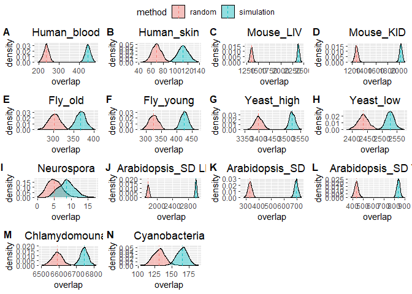

Figure4 markdown code and plot
================
Wanglab
2021.2.19

``` r
library(ggplot2)
library(dplyr)
```

    ## 
    ## Attaching package: 'dplyr'

    ## The following objects are masked from 'package:stats':
    ## 
    ##     filter, lag

    ## The following objects are masked from 'package:base':
    ## 
    ##     intersect, setdiff, setequal, union

``` r
set.seed(1)
range1 <- c(19,19,24,24,24,24,24,24,24,24,24,24,19,19)
range2 <- c(28,22,35,35,35,35,43,47,35,35,35,35,26,28)

path_DirEightSpieces = 'ContainedData/Meta2dResult/AllSpecies/'
  vector_FilenameAllTissues = c("Human_blood.csv","Human_skin.csv","Mouse_LIV.csv","Mouse_KID.csv","Fly_old.csv","Fly_young.csv","Yeast_high.csv","Yeast_low.csv","Neurospora.csv","Arabidopsis_SD LEAF.csv","Arabidopsis_SD M.csv",
                                "Arabidopsis_SD VA.csv","Chlamydomounas.csv","Cyanobacteria.csv")
  vector_NameAllTissues = c("Human_blood","Human_skin","Mouse_LIV","Mouse_KID","Fly_old","Fly_young","Yeast_high","Yeast_low","Neurospora","Arabidopsis_SD LEAF","Arabidopsis_SD M",
                            "Arabidopsis_SD VA","Chlamydomounas","Cyanobacteria")
  id_ShowNumAllTissues = c(1:14)
{
  par(mfrow = c(4,4))
  table2 = c()
  set.seed(1)
  for(i in id_ShowNumAllTissues)
  {
    {
      expr = read.csv(paste0(path_DirEightSpieces,vector_FilenameAllTissues[i]))
      ind_pc = expr$CycID != "#N/A"
      expr = expr[ind_pc,]   
      expr_mean = log(expr$meta2d_Base)
      expr_amp = log(expr$meta2d_AMP)
      expr_range <- apply(expr[,c(range1[i]:range2[i])],1, function(x){return(max(x) - min(x))})
      expr_ramp = log(expr$meta2d_rAMP)
      ind_bhq005 = expr$meta2d_BH.Q<0.05
    }
    ind_cir = 'ind_bhq005'
    aa0 = cbind(expr_mean,expr_range,ind_bhq005)
    aa = aa0[order(aa0[,'expr_range'],decreasing = T),];thresh_ind =
      which(aa[,ind_cir]==1)[round(sum(aa[,ind_cir])*0.95)];aa = aa[1:thresh_ind,]
    table1 = c(nrow(aa0),nrow(aa),round(nrow(aa)/nrow(aa0),2),
               sum(aa0[,ind_cir]),sum(aa[,ind_cir]),round(sum(aa[,ind_cir])/sum(aa0[,ind_cir]),2))
    aa = aa[order(aa[,'expr_mean']),]
    dd = exp(aa[,'expr_mean'])
    ee = replicate(1000,{
      # print(a <<- a+1)
      ind_simu = sample(1:nrow(aa),size = sum(aa[,ind_cir]),prob = dd)
      sum(aa[ind_simu,ind_cir])
    })
    ee1 = replicate(1000,{
      ind_simu = sample(1:nrow(aa0),size = sum(aa0[,ind_cir]))
      sum(aa0[ind_simu,ind_cir])
    })
    if (i==19) {
      ee1 = ee1+abs(rnorm(length(ee1),0,0.5))
    }
    m = sum(aa0[,ind_cir])
    n = nrow(aa0) - sum(aa0[,ind_cir])
    k = sum(aa0[,ind_cir])
    dhydata = dhyper(0:m,m,n,k) 
    plot(
      density(ee)
      ,xlim = c(min(ee1),max(ee))
      ,ylim = c(0,max(table(ee)/length(ee),dhydata[dhydata>0.001]))
      ,xlab = NA,main = vector_NameAllTissues[i],ylab = 'frequency'
      ,type = 'l',xaxt = 'n')
    abline(v=mean(ee),lty = 2)
    axis(side = 1)
    lines(density(ee1),col='red')
    abline(v=mean(ee1),lty = 2,col='red')
    table1 = c(table1,c(round(mean(ee),2),round(m^2/(m+n),2),wilcox.test(ee,mu = round(m^2/(m+n),2))$p.value,max(ee)))
    table2 = rbind(table2,table1)
    print(vector_NameAllTissues[i])
    print(table1)
  }
  rownames(table2) = vector_NameAllTissues[id_ShowNumAllTissues]
  colnames(table2) = c('num_all','num_sele','ratio','cir_all','cir_sele','ratio_cir','cir_real','cir_simu','wilcox-test.p','cir_RealMax')
  print(table2)
  #write.csv(table2,'table2.csv')
  par(mfcol = c(1,1))
} 
```

    ## [1] "Human_blood"
    ##  [1]  1.699600e+04  1.264800e+04  7.400000e-01  2.011000e+03  1.910000e+03
    ##  [6]  9.500000e-01  4.405800e+02  2.379500e+02 3.126876e-165  4.780000e+02

    ## [1] "Human_skin"
    ##  [1]  1.699600e+04  1.084900e+04  6.400000e-01  1.086000e+03  1.032000e+03
    ##  [6]  9.500000e-01  1.127500e+02  6.939000e+01 2.941002e-165  1.380000e+02

    ## [1] "Mouse_LIV"
    ##  [1]  1.978800e+04  1.384800e+04  7.000000e-01  5.170000e+03  4.912000e+03
    ##  [6]  9.500000e-01  2.382970e+03  1.350760e+03 3.264665e-165  2.454000e+03

    ## [1] "Mouse_KID"
    ##  [1]  1.978800e+04  1.402900e+04  7.100000e-01  5.018000e+03  4.767000e+03
    ##  [6]  9.500000e-01  2.020590e+03  1.272500e+03 3.265832e-165  2.087000e+03

    ## [1] "Fly_old"
    ##  [1]  1.021200e+04  8.571000e+03  8.400000e-01  1.756000e+03  1.668000e+03
    ##  [6]  9.500000e-01  3.674800e+02  3.019500e+02 3.125965e-165  4.040000e+02

    ## [1] "Fly_young"
    ##  [1]  1.021200e+04  8.476000e+03  8.300000e-01  1.817000e+03  1.726000e+03
    ##  [6]  9.500000e-01  4.244200e+02  3.233000e+02 3.126836e-165  4.710000e+02

    ## [1] "Yeast_high"
    ##  [1]  6.068000e+03  5.377000e+03  8.900000e-01  4.571000e+03  4.342000e+03
    ##  [6]  9.500000e-01  3.540260e+03  3.443320e+03 3.031106e-165  3.571000e+03

    ## [1] "Yeast_low"
    ##  [1]  6.068000e+03  5.401000e+03  8.900000e-01  3.864000e+03  3.671000e+03
    ##  [6]  9.500000e-01  2.543240e+03  2.460530e+03 3.163376e-165  2.590000e+03

    ## [1] "Neurospora"
    ##  [1]  9.733000e+03  7.769000e+03  8.000000e-01  2.100000e+02  2.000000e+02
    ##  [6]  9.500000e-01  8.260000e+00  4.530000e+00 6.973868e-156  2.000000e+01

    ## [1] "Arabidopsis_SD LEAF"
    ##  [1]  1.991400e+04  1.392900e+04  7.000000e-01  5.947000e+03  5.650000e+03
    ##  [6]  9.500000e-01  2.997080e+03  1.775980e+03 3.249502e-165  3.060000e+03

    ## [1] "Arabidopsis_SD M"
    ##  [1]  1.99140e+04  1.61370e+04  8.10000e-01  2.56900e+03  2.44100e+03
    ##  [6]  9.50000e-01  6.94100e+02  3.31410e+02 3.16574e-165  7.39000e+02

    ## [1] "Arabidopsis_SD VA"
    ##  [1]  1.991400e+04  1.520600e+04  7.600000e-01  2.937000e+03  2.790000e+03
    ##  [6]  9.500000e-01  8.382400e+02  4.331600e+02 3.194181e-165  8.840000e+02

    ## [1] "Chlamydomounas"
    ##  [1]  1.610400e+04  1.457600e+04  9.100000e-01  1.030300e+04  9.788000e+03
    ##  [6]  9.500000e-01  6.743500e+03  6.591640e+03 3.262179e-165  6.828000e+03

<!-- -->

    ## [1] "Cyanobacteria"
    ##  [1]  2.490000e+03  1.872000e+03  7.500000e-01  5.720000e+02  5.430000e+02
    ##  [6]  9.500000e-01  1.648100e+02  1.314000e+02 2.824182e-165  1.880000e+02
    ##                     num_all num_sele ratio cir_all cir_sele ratio_cir cir_real
    ## Human_blood           16996    12648  0.74    2011     1910      0.95   440.58
    ## Human_skin            16996    10849  0.64    1086     1032      0.95   112.75
    ## Mouse_LIV             19788    13848  0.70    5170     4912      0.95  2382.97
    ## Mouse_KID             19788    14029  0.71    5018     4767      0.95  2020.59
    ## Fly_old               10212     8571  0.84    1756     1668      0.95   367.48
    ## Fly_young             10212     8476  0.83    1817     1726      0.95   424.42
    ## Yeast_high             6068     5377  0.89    4571     4342      0.95  3540.26
    ## Yeast_low              6068     5401  0.89    3864     3671      0.95  2543.24
    ## Neurospora             9733     7769  0.80     210      200      0.95     8.26
    ## Arabidopsis_SD LEAF   19914    13929  0.70    5947     5650      0.95  2997.08
    ## Arabidopsis_SD M      19914    16137  0.81    2569     2441      0.95   694.10
    ## Arabidopsis_SD VA     19914    15206  0.76    2937     2790      0.95   838.24
    ## Chlamydomounas        16104    14576  0.91   10303     9788      0.95  6743.50
    ## Cyanobacteria          2490     1872  0.75     572      543      0.95   164.81
    ##                     cir_simu wilcox-test.p cir_RealMax
    ## Human_blood           237.95 3.126876e-165         478
    ## Human_skin             69.39 2.941002e-165         138
    ## Mouse_LIV            1350.76 3.264665e-165        2454
    ## Mouse_KID            1272.50 3.265832e-165        2087
    ## Fly_old               301.95 3.125965e-165         404
    ## Fly_young             323.30 3.126836e-165         471
    ## Yeast_high           3443.32 3.031106e-165        3571
    ## Yeast_low            2460.53 3.163376e-165        2590
    ## Neurospora              4.53 6.973868e-156          20
    ## Arabidopsis_SD LEAF  1775.98 3.249502e-165        3060
    ## Arabidopsis_SD M      331.41 3.165740e-165         739
    ## Arabidopsis_SD VA     433.16 3.194181e-165         884
    ## Chlamydomounas       6591.64 3.262179e-165        6828
    ## Cyanobacteria         131.40 2.824182e-165         188

``` r
library(plyr)
```

    ## ------------------------------------------------------------------------------

    ## You have loaded plyr after dplyr - this is likely to cause problems.
    ## If you need functions from both plyr and dplyr, please load plyr first, then dplyr:
    ## library(plyr); library(dplyr)

    ## ------------------------------------------------------------------------------

    ## 
    ## Attaching package: 'plyr'

    ## The following objects are masked from 'package:dplyr':
    ## 
    ##     arrange, count, desc, failwith, id, mutate, rename, summarise,
    ##     summarize

``` r
library(ggpubr)
```

    ## 
    ## Attaching package: 'ggpubr'

    ## The following object is masked from 'package:plyr':
    ## 
    ##     mutate

``` r
set.seed(1)
path_DirEightSpieces = 'ContainedData/Meta2dResult/AllSpecies/'
  vector_FilenameAllTissues = c("Human_blood.csv","Human_skin.csv","Mouse_LIV.csv","Mouse_KID.csv","Fly_old.csv","Fly_young.csv","Yeast_high.csv","Yeast_low.csv","Neurospora.csv","Arabidopsis_SD LEAF.csv","Arabidopsis_SD M.csv",
                                "Arabidopsis_SD VA.csv","Chlamydomounas.csv","Cyanobacteria.csv")
vector_NameAllTissues = c("Human_blood","Human_skin","Mouse_LIV","Mouse_KID","Fly_old","Fly_young","Yeast_high","Yeast_low","Neurospora","Arabidopsis_SD LEAF","Arabidopsis_SD M",
                            "Arabidopsis_SD VA","Chlamydomounas","Cyanobacteria")
id_ShowNumAllTissues = c(1:14)
range1 <- c(19,19,24,24,24,24,24,24,24,24,24,24,19,19)
range2 <- c(28,22,35,35,35,35,43,47,35,35,35,35,26,28)
p = list()
table2 = c()
set.seed(1)
for(i in id_ShowNumAllTissues)
{
  {
    expr = read.csv(paste0(path_DirEightSpieces,vector_FilenameAllTissues[i]))
    ind_pc = expr$CycID != "#N/A"
    expr = expr[ind_pc,]    
    expr_mean = log(expr$meta2d_Base)
    expr_amp = log(expr$meta2d_AMP)
    expr_range <- log(apply(expr[,c(range1[i]:range2[i])],1, function(x){return(max(x) - min(x))}))
    #expr_ramp = log(expr$meta2d_rAMP)
    expr_ramp = log(expr$meta2d_rAMP)
    ind_bhq005 = expr$meta2d_BH.Q<0.05
  }
 
  ind_cir = 'ind_bhq005'
  aa0 = cbind(expr_mean,expr_range,ind_bhq005)

  aa = aa0[order(aa0[,'expr_range'],decreasing = T),];thresh_ind = 
    which(aa[,ind_cir]==1)[round(sum(aa[,ind_cir])*0.95)];aa = aa[1:thresh_ind,]
  
  table1 = c(nrow(aa0),nrow(aa),round(nrow(aa)/nrow(aa0),2),
             sum(aa0[,ind_cir]),sum(aa[,ind_cir]),round(sum(aa[,ind_cir])/sum(aa0[,ind_cir]),2))

  aa = aa[order(aa[,'expr_mean']),]
  dd = exp(aa[,'expr_mean'])
  ee = replicate(1000,{
    ind_simu = sample(1:nrow(aa),size = sum(aa[,ind_cir]),prob = dd)
    sum(aa[ind_simu,ind_cir])
  })
  ee1 = replicate(1000,{
    # print(a <<- a+1)
    ind_simu = sample(1:nrow(aa0),size = sum(aa0[,ind_cir]))
    sum(aa0[ind_simu,ind_cir])
  })
  # points(density(ee1),col='red',pch = '.')
  if (i==9) {
    ee1 = ee1+abs(rnorm(length(ee1),0,0.5))
    ee = ee+abs(rnorm(length(ee),0,0.5))
  }
  m = sum(aa0[,ind_cir])
  n = nrow(aa0) - sum(aa0[,ind_cir])
  k = sum(aa0[,ind_cir])
  dhydata = dhyper(0:m,m,n,k)
  df = data.frame(
    overlap = c(ee,ee1)
    ,method = rep(c('simulation','random'),c(length(ee),length(ee1))))
  mu <- ddply(df, "method", summarise, grp.mean=mean(overlap))
  p_i <- ggplot(df, aes(x=overlap, fill=method)) +
    geom_density(alpha=0.4) + 
    geom_vline(data=mu, aes(xintercept=grp.mean, color=method),
               linetype="dashed")+ 
    labs(title = vector_NameAllTissues[i])+
    theme(plot.title=element_text(hjust=0.5))
  p[[i]] = p_i
  
  table1 = c(table1,c(round(mean(ee),2),round(m^2/(m+n),2),wilcox.test(ee,mu = round(m^2/(m+n),2))$p.value,max(ee)))
  table2 = rbind(table2,table1)
  print(vector_NameAllTissues[i])
  print(table1)
}
```

    ## [1] "Human_blood"
    ##  [1]  1.699600e+04  1.264800e+04  7.400000e-01  2.011000e+03  1.910000e+03
    ##  [6]  9.500000e-01  4.405800e+02  2.379500e+02 3.126876e-165  4.780000e+02
    ## [1] "Human_skin"
    ##  [1]  1.699600e+04  1.084900e+04  6.400000e-01  1.086000e+03  1.032000e+03
    ##  [6]  9.500000e-01  1.127500e+02  6.939000e+01 2.941002e-165  1.380000e+02
    ## [1] "Mouse_LIV"
    ##  [1]  1.978800e+04  1.385100e+04  7.000000e-01  5.170000e+03  4.912000e+03
    ##  [6]  9.500000e-01  2.382300e+03  1.350760e+03 3.268024e-165  2.455000e+03
    ## [1] "Mouse_KID"
    ##  [1]  1.978800e+04  1.402900e+04  7.100000e-01  5.018000e+03  4.767000e+03
    ##  [6]  9.500000e-01  2.020590e+03  1.272500e+03 3.265832e-165  2.087000e+03
    ## [1] "Fly_old"
    ##  [1]  1.021200e+04  8.571000e+03  8.400000e-01  1.756000e+03  1.668000e+03
    ##  [6]  9.500000e-01  3.674800e+02  3.019500e+02 3.125965e-165  4.040000e+02
    ## [1] "Fly_young"
    ##  [1]  1.021200e+04  8.476000e+03  8.300000e-01  1.817000e+03  1.726000e+03
    ##  [6]  9.500000e-01  4.244200e+02  3.233000e+02 3.126836e-165  4.710000e+02
    ## [1] "Yeast_high"
    ##  [1]  6.068000e+03  5.377000e+03  8.900000e-01  4.571000e+03  4.342000e+03
    ##  [6]  9.500000e-01  3.540260e+03  3.443320e+03 3.031106e-165  3.571000e+03
    ## [1] "Yeast_low"
    ##  [1]  6.068000e+03  5.401000e+03  8.900000e-01  3.864000e+03  3.671000e+03
    ##  [6]  9.500000e-01  2.543240e+03  2.460530e+03 3.163376e-165  2.590000e+03
    ## [1] "Neurospora"
    ##  [1]  9.733000e+03  7.769000e+03  8.000000e-01  2.100000e+02  2.000000e+02
    ##  [6]  9.500000e-01  8.660000e+00  4.530000e+00 1.937959e-161  2.027377e+01
    ## [1] "Arabidopsis_SD LEAF"
    ##  [1]  1.991400e+04  1.392900e+04  7.000000e-01  5.947000e+03  5.650000e+03
    ##  [6]  9.500000e-01  2.997120e+03  1.775980e+03 3.257235e-165  3.068000e+03
    ## [1] "Arabidopsis_SD M"
    ##  [1]  1.991400e+04  1.613700e+04  8.100000e-01  2.569000e+03  2.441000e+03
    ##  [6]  9.500000e-01  6.936000e+02  3.314100e+02 3.166013e-165  7.320000e+02
    ## [1] "Arabidopsis_SD VA"
    ##  [1]  1.991400e+04  1.520600e+04  7.600000e-01  2.937000e+03  2.790000e+03
    ##  [6]  9.500000e-01  8.372600e+02  4.331600e+02 3.198649e-165  8.870000e+02
    ## [1] "Chlamydomounas"
    ##  [1]  1.610400e+04  1.457600e+04  9.100000e-01  1.030300e+04  9.788000e+03
    ##  [6]  9.500000e-01  6.743500e+03  6.591640e+03 3.262179e-165  6.828000e+03
    ## [1] "Cyanobacteria"
    ##  [1]  2.490000e+03  1.872000e+03  7.500000e-01  5.720000e+02  5.430000e+02
    ##  [6]  9.500000e-01  1.648100e+02  1.314000e+02 2.824182e-165  1.880000e+02

``` r
ggarrange(plotlist = p[id_ShowNumAllTissues]
          ,ncol = 4,nrow = 4
          # ,labels = vector_NameAllTissues[id_ShowNumAllTissues]
          ,labels = LETTERS[1:14]
          ,font.label = list(size = 12,face='bold',col='black')
          ,common.legend = T)
```

<!-- -->
