Figure5 markdown code and plot
================
Wanglab
2021.6.28

``` r
library(dplyr)
```

    ## 
    ## Attaching package: 'dplyr'

    ## The following objects are masked from 'package:stats':
    ## 
    ##     filter, lag

    ## The following objects are masked from 'package:base':
    ## 
    ##     intersect, setdiff, setequal, union

``` r
library(venn)
library(gplots)
```

    ## 
    ## Attaching package: 'gplots'

    ## The following object is masked from 'package:venn':
    ## 
    ##     venn

    ## The following object is masked from 'package:stats':
    ## 
    ##     lowess

``` r
library(plotrix)
```

    ## 
    ## Attaching package: 'plotrix'

    ## The following object is masked from 'package:gplots':
    ## 
    ##     plotCI

``` r
library(tidyr)
library(ggplot2)
source("FunctionForCodeNew.R")
result<- YeastCalculateCost()
SG <- result[[1]]
genename <- result[[2]]
R_RNA <- result[[3]]
Ne = 10^7
S0 = 4/Ne

table(rowSums(na.omit(SG)>S0))
```

    ## 
    ##    0    1    2    3    4    5    6    7    8    9   10   11   12   13   14   15 
    ##  384   40   28    9   11   14   11   13   13   14   14   12   12   13   17   21 
    ##   16   17   18   19   20 
    ##   28   22   49   77 5266

``` r
plot(density(log10(na.omit(rowrange(SG)))),
     xlab = 'log10(selection coefficient)',main = 'density of yeast cost'
     ,lwd = 2)
abline(v = log10(S0),lty = 2,lwd = 2)
```

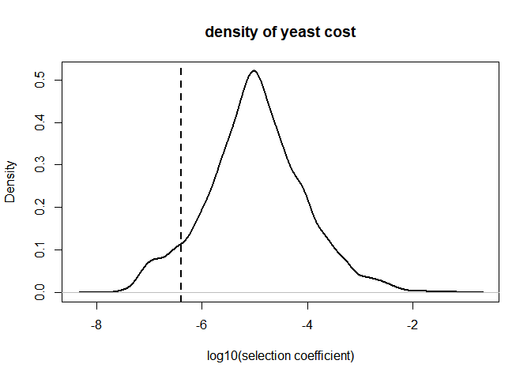<!-- -->

``` r
sum(rowrange(SG) > S0)
```

    ## [1] 5606

``` r
matrix_MetaExpr = read.csv(
  'ContainedData/EnergyCost/meta2d_sample2.csv')
rownames(matrix_MetaExpr) = matrix_MetaExpr$CycID
matrix_MetaExpr = matrix_MetaExpr[genename,]

point_pcc(matrix_MetaExpr$meta2d_Base %>% log10(),rowrange(SG) %>% log10()
          ,xlab = 'log10(expression level)',ylab = 'log10(selection pressure)'
          ,main = 'yeast'
          ,textx = -1.5,text1y = -2,text2y = -3)
```

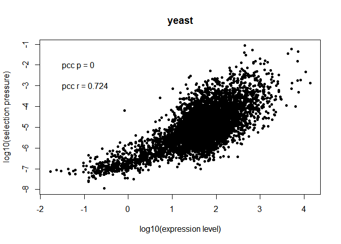<!-- -->

``` r
id_cir = matrix_MetaExpr$meta2d_BH.Q<0.05
id_select = rowrange(SG)>S0
res_fishertest = fisher.test(id_cir,id_select)
res_fishertest
```

    ## 
    ##  Fisher's Exact Test for Count Data
    ## 
    ## data:  id_cir and id_select
    ## p-value < 2.2e-16
    ## alternative hypothesis: true odds ratio is not equal to 1
    ## 95 percent confidence interval:
    ##   7.835287 12.136262
    ## sample estimates:
    ## odds ratio 
    ##   9.731228

``` r
library(venn)

input = list(circadian = which(id_cir),CostSelected = which(id_select))
venn(input)
text(1,200,paste0('fisher.test',
                  '\n','p = ',round(res_fishertest$p.value,2), 
                  '\n','OR = ',round(res_fishertest$estimate,2)
),pos = 4)
```

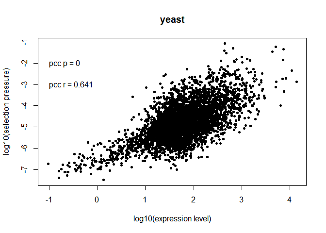<!-- -->

``` r
# 
xxxtmp = matrix_MetaExpr
id = xxxtmp$meta2d_phase*13<26
xxxtmp$meta2d_phase[id] = xxxtmp$meta2d_phase[id] + xxxtmp$meta2d_period[id]
xxxtmp$meta2d_phase = xxxtmp$meta2d_phase-2


plot(xxxtmp$meta2d_phase[id_cir] %>% density(),
     main = 'distribution of circadian phase in yeast'
     ,xlab = 'time(minute)'
     ,lwd = 2)
abline(v = 65,lty = 2,lwd = 2)
```

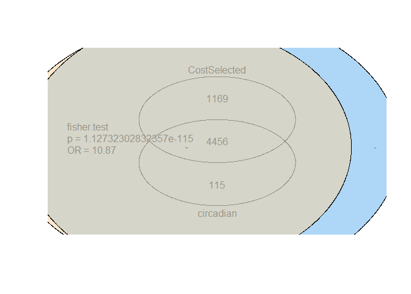<!-- -->

``` r
early_matrix = matrix_MetaExpr[matrix_MetaExpr$meta2d_phase<5,]
late_matrix = matrix_MetaExpr[matrix_MetaExpr$meta2d_phase>=5,]
id_cir_early = early_matrix$meta2d_BH.Q<0.05
id_cir_late = late_matrix$meta2d_BH.Q<0.05
id_BoolEarlyPeak = id_cir_early & early_matrix$meta2d_phase<5
id_BoolLatePeak = id_cir_late & late_matrix$meta2d_phase>=5


timelist = 0:19

vector_TimeEarlyPeak = timelist %in% c(0:4,10:14)
vector_TimeLatePeak = timelist %in% c(5:9,15:19)
matrix_MetaExprEarlyPeak = early_matrix[,24:43][id_BoolEarlyPeak,vector_TimeEarlyPeak]
matrix_MetaExprLatePeak = late_matrix[,24:43][id_BoolLatePeak,vector_TimeLatePeak]
SG_early = SG[rownames(early_matrix),]
SG_late = SG[rownames(late_matrix),]
SG_EarlyPeak = SG_early[,vector_TimeEarlyPeak]
SG_LatePeak = SG_late[,vector_TimeLatePeak]
id_SelectEarlyPeak = rowrange(SG_EarlyPeak)>S0
id_SelectLatePeak = rowrange(SG_LatePeak)>S0
id_select = rowrange(SG)>S0
library(venn)
input = list(circadian = which(id_BoolEarlyPeak),CostSelected = which(id_SelectEarlyPeak))
venn(input)
res_fishertest = fisher.test(id_BoolEarlyPeak,id_SelectEarlyPeak)
text(1,200,paste0('fisher.test',
                  '\n','p = ',round(res_fishertest$p.value,2), 
                  '\n','OR = ',round(res_fishertest$estimate,2)
),pos = 4)
```

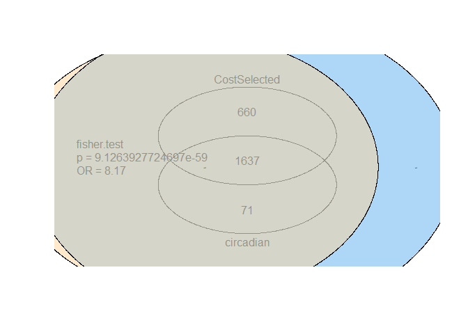<!-- -->

``` r
input = list(circadian = which(id_BoolLatePeak),CostSelected = which(id_SelectLatePeak))
venn(input)
res_fishertest = fisher.test(id_BoolLatePeak,id_SelectLatePeak)
text(1,200,paste0('fisher.test',
                  '\n','p = ',round(res_fishertest$p.value,2), 
                  '\n','OR = ',round(res_fishertest$estimate,2)
),pos = 4)
```

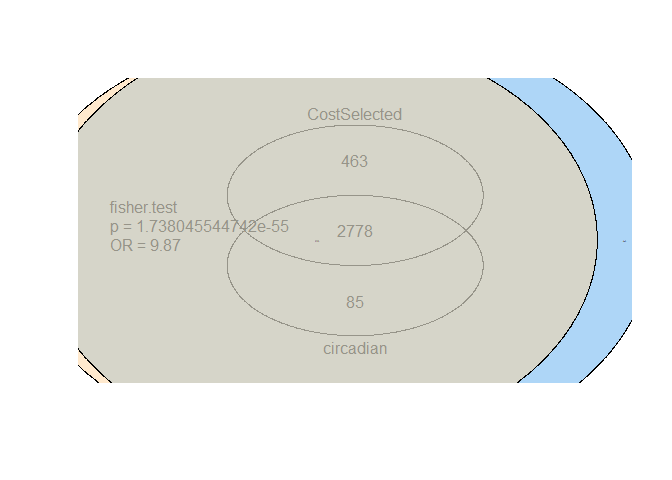<!-- -->

``` r
vector_SGRange = rowrange(SG_EarlyPeak)
vector_ProbSeleDiffNumb = 1:10
set.seed(1)
for (i in 1:10) {
  res_ProbSeleDiffNumb = replicate(1000,{
    id_NumSample = sample(nrow(SG_EarlyPeak),i)
    sum(vector_SGRange[id_NumSample]) > S0
  }) %>% mean()
  vector_ProbSeleDiffNumb[i] = res_ProbSeleDiffNumb
}


vector_SGRange = rowrange(SG_LatePeak)
vector_ProbSeleDiffNumb = 1:10
set.seed(1)
for (i in 1:10) {
  res_ProbSeleDiffNumb = replicate(1000,{
    id_NumSample = sample(nrow(SG_LatePeak),i)
    sum(vector_SGRange[id_NumSample]) > S0
  }) %>% mean()
  vector_ProbSeleDiffNumb[i] = res_ProbSeleDiffNumb
}
```

``` r
source("FunctionForCodeNew.R")
SG <- MouseCalculateCost()
#max select cost
print(max(SG))
```

    ## [1] 0.002776215

``` r
Ne_mouse = c(25000,120000)
Ne = Ne_mouse
Ne = mean(Ne)
S0 = 4/Ne
# 
sum(rowrange(SG) > S0)
```

    ## [1] 716

``` r
plot(density(log10(na.omit(rowrange(SG)))),
     xlab = 'log10(selection coefficient)',main = 'density of mouse cost'
     ,lwd = 2)
abline(v = log10(S0),lwd = 2,lty = 2)
```

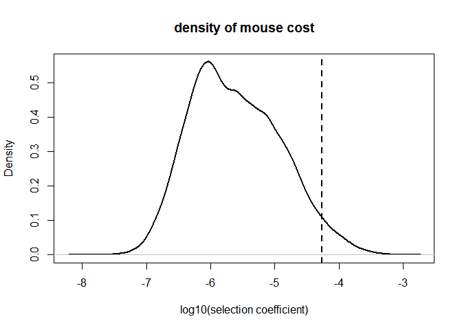<!-- -->

``` r
matrix_MetaExpr = read.csv('ContainedData/EnergyCost/meta2d_MouseLiver.csv')

point_pcc(matrix_MetaExpr$meta2d_Base %>% log10(),rowrange(SG) %>% log10()
          ,xlab = 'log10(expression level)',ylab = 'log10(selection pressure)'
          ,main = 'mouse liver'
          ,textx = 1.5,text1y = -3,text2y = -3.5)
```

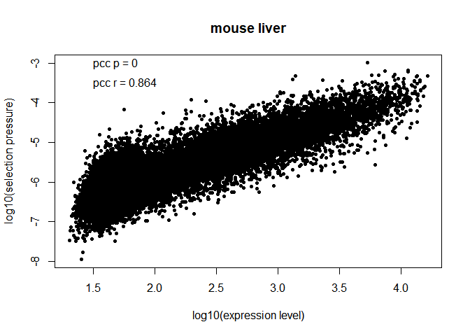<!-- -->

``` r
id_cir = matrix_MetaExpr$meta2d_BH.Q<0.05
id_select = rowrange(SG)>S0
res_fishertest = fisher.test(id_cir,id_select)
res_fishertest
```

    ## 
    ##  Fisher's Exact Test for Count Data
    ## 
    ## data:  id_cir and id_select
    ## p-value < 2.2e-16
    ## alternative hypothesis: true odds ratio is not equal to 1
    ## 95 percent confidence interval:
    ##  4.467703 6.136579
    ## sample estimates:
    ## odds ratio 
    ##   5.232214

``` r
library(venn)
input = list(circadian = which(id_cir),CostSelected = which(id_select))
venn(input)
text(1,200,paste0('fisher.test',
                  '\n','p = ',round(res_fishertest$p.value,2), 
                  '\n','OR = ',round(res_fishertest$estimate,2)
),pos = 4)
```

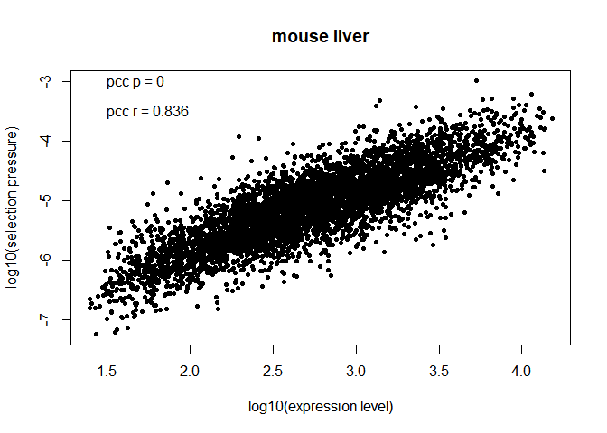<!-- -->

``` r
vector_SGRange = rowrange(SG)
vector_ProbSeleDiffNumb = 1:10
set.seed(1)
for (i in 1:10) {
  res_ProbSeleDiffNumb = replicate(1000,{
    id_NumSample = sample(which(id_cir),i)
    sum(vector_SGRange[id_NumSample]) > S0
  }) %>% mean()
  vector_ProbSeleDiffNumb[i] = res_ProbSeleDiffNumb
}
barplot(height = vector_ProbSeleDiffNumb
        ,names.arg = 1:10
        ,ylab = 'probability to be selected',xlab = 'gene number',main = 'mouse liver'
        ,col = 'blue')
abline(h = 0.95,lwd = 2,lty = 2)
text(1,0.9,0.95,cex = 1.2)
```

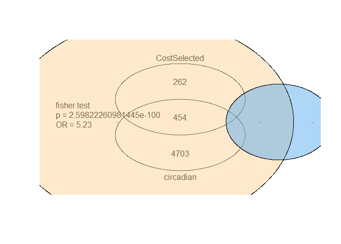<!-- -->

``` r
plot(matrix_MetaExpr$meta2d_phase[id_cir] %>% density(),
     main = 'distribution of circadian phase in mouse liver'
     ,xlab = 'time(hour)'
     ,lwd = 2)
abline(v = 12,lty = 2,lwd = 2)
```

<!-- -->

``` r
early_matrix = matrix_MetaExpr[matrix_MetaExpr$meta2d_phase<12,]
late_matrix = matrix_MetaExpr[matrix_MetaExpr$meta2d_phase>=12,]
id_cir_early = early_matrix$meta2d_BH.Q<0.05
id_cir_late = late_matrix$meta2d_BH.Q<0.05
id_BoolEarlyPeak = id_cir_early & early_matrix$meta2d_phase<12
id_BoolLatePeak = id_cir_late & late_matrix$meta2d_phase>=12


timelist = seq(18,64,by = 2)

vector_TimeEarlyPeak = timelist %in% c(1:12,25:36,49:60)
vector_TimeLatePeak = timelist %in% c(13:24,37:48,61:72)
matrix_MetaExprEarlyPeak = matrix_MetaExpr[,24:47][id_BoolEarlyPeak,vector_TimeEarlyPeak]
matrix_MetaExprLatePeak = matrix_MetaExpr[,24:47][id_BoolLatePeak,vector_TimeLatePeak]
SG_early = SG[early_matrix$CycID,]
SG_late = SG[late_matrix$CycID,]
SG_EarlyPeak = SG_early[,vector_TimeEarlyPeak]
SG_LatePeak = SG_late[,vector_TimeLatePeak]
id_SelectEarlyPeak = rowrange(SG_EarlyPeak)>S0
id_SelectLatePeak = rowrange(SG_LatePeak)>S0
id_select = rowrange(SG)>S0
library(venn)
input = list(circadian = which(id_BoolEarlyPeak),CostSelected = which(id_SelectEarlyPeak))
venn(input)
res_fishertest = fisher.test(id_BoolEarlyPeak,id_SelectEarlyPeak)
text(1,200,paste0('fisher.test',
                  '\n','p = ',round(res_fishertest$p.value,2), 
                  '\n','OR = ',round(res_fishertest$estimate,2)
),pos = 4)
```

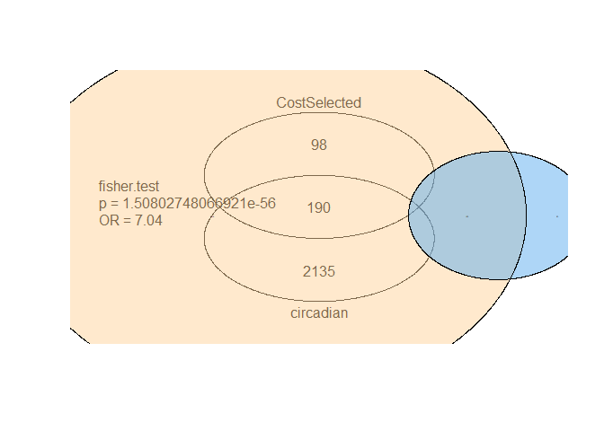<!-- -->

``` r
input = list(circadian = which(id_BoolLatePeak),CostSelected = which(id_SelectLatePeak))
venn(input)
res_fishertest = fisher.test(id_BoolLatePeak,id_SelectLatePeak)
text(1,200,paste0('fisher.test',
                  '\n','p = ',round(res_fishertest$p.value,2), 
                  '\n','OR = ',round(res_fishertest$estimate,2)
),pos = 4)
```

<!-- -->

``` r
id_cir = matrix_MetaExpr$meta2d_BH.Q<0.05
id_BoolEarlyPeak = id_cir & matrix_MetaExpr$meta2d_phase<12
id_BoolLatePeak = id_cir & matrix_MetaExpr$meta2d_phase>=12


timelist = seq(18,64,by = 2)

vector_TimeEarlyPeak = timelist %in% c(1:12,25:36,49:60)
vector_TimeLatePeak = timelist %in% c(13:24,37:48,61:72)
matrix_MetaExprEarlyPeak = matrix_MetaExpr[,24:47][id_BoolEarlyPeak,vector_TimeEarlyPeak]
matrix_MetaExprLatePeak = matrix_MetaExpr[,24:47][id_BoolLatePeak,vector_TimeLatePeak]
SG_EarlyPeak = SG[id_BoolEarlyPeak,vector_TimeEarlyPeak]
SG_LatePeak = SG[id_BoolLatePeak,vector_TimeLatePeak]
id_SelectEarlyPeak = rowrange(SG_EarlyPeak)>S0
id_SelectLatePeak = rowrange(SG_LatePeak)>S0
id_select = rowrange(SG)>S0


vector_SGRange = rowrange(SG_EarlyPeak)
vector_ProbSeleDiffNumb = 1:12
set.seed(1)
for (i in 1:12) {
  res_ProbSeleDiffNumb = replicate(1000,{
    id_NumSample = sample(nrow(SG_EarlyPeak),i)
    sum(vector_SGRange[id_NumSample]) > S0
  }) %>% mean()
  vector_ProbSeleDiffNumb[i] = res_ProbSeleDiffNumb
}
barplot(height = vector_ProbSeleDiffNumb
        ,names.arg = 1:12
        ,ylab = 'probability to be selected',xlab = 'gene number',main = 'mouse liver early peak'
        ,col = 'blue')
abline(h = 0.95,lty = 2,lwd = 2)
text(1,0.9,0.95,cex = 1.2)
```

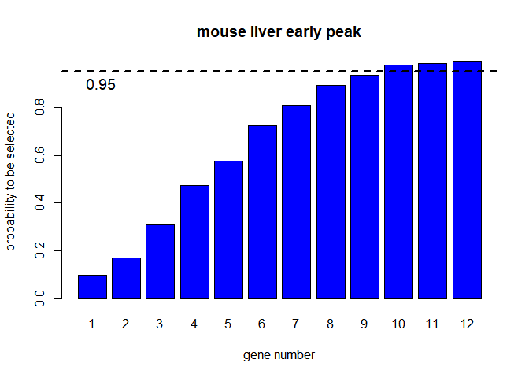<!-- -->

``` r
vector_SGRange = rowrange(SG_LatePeak)
vector_ProbSeleDiffNumb = 1:12
set.seed(1)
for (i in 1:12) {
  res_ProbSeleDiffNumb = replicate(1000,{
    id_NumSample = sample(nrow(SG_LatePeak),i)
    sum(vector_SGRange[id_NumSample]) > S0
  }) %>% mean()
  vector_ProbSeleDiffNumb[i] = res_ProbSeleDiffNumb
}
barplot(height = vector_ProbSeleDiffNumb
        ,names.arg = 1:12
        ,ylab = 'probability to be selected',xlab = 'gene number',main = 'mouse liver late peak'
        ,col = 'blue')
abline(h = 0.95,lty = 2,lwd = 2)
text(1,0.9,0.95,cex = 1.2)
```

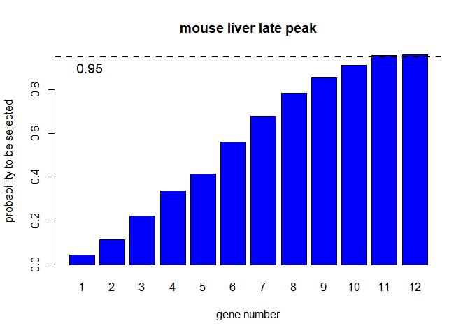<!-- -->
