Simulation code and plot
================
Wanglab
2021.6.28

``` r
set.seed(1)
library(parallel)
library(MetaCycle)
library(dplyr)
library(tidyr)
func_num = 1000
time_num = 24
gene_num = 10000
gene_len = 1002
cost_c_low = 1
cost_c_up = 10000
    
func_num_gene_low = 1
func_num_gene_up = 100
expr_func_gene_low = 10
expr_func_gene_up = 100
point_pcc = function(x,y,xlab='',ylab='',main='',textx=0,text1y=0,text2y=0,cex=1,...){
  plot(x,y,
       ...,
       xlab = xlab, ylab = ylab, main = main,
       pch = 20)
  text_pvalue = cor.test(x,y)$p.value %>% 
    round(digits = 3)
  text_cor = cor.test(x,y)$estimate %>% 
    round(digits = 3)
  text(textx,text1y,paste0('pcc p = ',text_pvalue),
       pos = 4, cex = cex,offset = 0)
  text(textx,text2y,paste0('pcc r = ',text_cor),
       pos = 4,cex = cex,offset = 0)
}
n_level_num = function(data,id,n=5){
  data_num = length(data)
  id_ordered = id[order(data)]
  id_group = round((data_num/n)*1:n)
  id_group_1 = c(0,id_group[-n])+1
  id_group_2 = id_group
  inlevel_num = 1:n
  for (i in 1:n) {
    inlevel_num[i] = sum(id_ordered[id_group_1[i]:id_group_2[i]])
  }
  return(inlevel_num)
}
single_parallel <- function(func,iterable,...,cores = 0,env_val = c(),packages = c()){

  library(parallel)
 
  if (cores != 0) {
    cl <- makeCluster(cores)
  }
  else{
    cores <- detectCores()
    cl <- makeCluster(cores)
  }

  clusterExport(cl,deparse(substitute(func)))
  clusterExport(cl,env_val)
  clusterExport(cl,'packages',envir = environment())
  clusterEvalQ(cl,{
    for (i in packages) {
      library(i,character.only = T)
    }
  })
  result <- parSapply(cl,iterable,func,...)

  stopCluster(cl)
  return(result)
}
```

``` r
# cost of each gene
# gene length
gene_len_codon = rep(300,gene_num)
gene_len_codon %>% density() %>% plot(
  xlim = c(),
  xlab = 'gene length(codon number)',ylab = 'density',main = 'simulation')
```

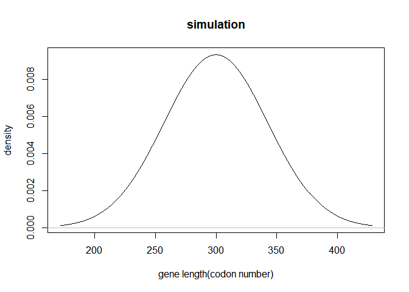<!-- -->

``` r
#gene codon
set.seed(1)
baseT=c('U','C','A','G')
codonT=c()
for(i in baseT){
  for(j in baseT){
    for(k in baseT){
      codonT=c(codonT,paste0(i,j,k))
    }
  }
}
codonAA = c("F","F","L","L",
            "S","S","S","S",
            "Y","Y","*","*",
            "C","C","*","W",
            "L","L","L","L",
            "P","P","P","P",
            "H","H","Q","Q",
            "R","R","R","R",
            "I","I","I","M",
            "T","T","T","T",
            "N","N","K","K",
            "S","S","R","R",
            "V","V","V","V",
            "A","A","A","A",
            "D","D","E","E",
            "G","G","G","G")
CM_RNA = c(48.5,49.5,48.5,51.5)
names(CM_RNA) = c('A','C','G','U') 
CM_PRO = c(29.075,14.5,20.5,18.5,15.5,26.5,10.5,9.5,14.5,29,38,37,36,36.5,61,14.5,14.5,21.5,75.5,59,29)
names(CM_PRO) = c('X','A','R','N','D','C','Q','E','G','H','I','L','K','M','F','P','S','T','W','Y','V')
sequence_list = rep('a',gene_num)
sequence_list_pro = rep('a',gene_num)
cost_c = rep(0,gene_num)
cost_cpro = rep(0,gene_num)
system.time(
  for (i in 1:gene_num) {
    tmp = sample((1:64)[-c(11,12,15)],gene_len_codon[i],replace = T)
    tmp = c(36,tmp)
    sequence_list[i] = codonT[tmp] %>% paste0(collapse = '')
    sequence_list_pro[i] = codonAA[tmp] %>% paste0(collapse = '')
    id_M = strsplit(sequence_list[i],'')[[1]]
    id_Mpro = strsplit(sequence_list_pro[i],'')[[1]]
    cost_c[i] = CM_RNA[id_M] %>% sum()
    cost_cpro[i] = CM_PRO[id_Mpro] %>% sum()
  })
##    user  system elapsed 
##    4.00    0.00    4.32
cost_cpro = cost_cpro+4*gene_len_codon+3
```

``` r
#distribution of matrix_gene_func_bool in 8 species
filename = c("ContainedData/EnergyCost/go_annotation_matrix/arabidopsis_go_anno.csv",
             "ContainedData/EnergyCost/go_annotation_matrix/chalm_go_anno.csv",
             "ContainedData/EnergyCost/go_annotation_matrix/cyanobacteria_go_anno.csv",
             "ContainedData/EnergyCost/go_annotation_matrix/fly_go_anno.csv",
             "ContainedData/EnergyCost/go_annotation_matrix/human_go_anno.csv",
             "ContainedData/EnergyCost/go_annotation_matrix/mouse_go_anno.csv",
             "ContainedData/EnergyCost/go_annotation_matrix/neurospora_go_anno.csv",
             "ContainedData/EnergyCost/go_annotation_matrix/yeast_go_anno.csv")
speciesname = strsplit(filename,split = '\\\\') %>% 
  lapply('[',6) %>% 
  unlist %>% 
  strsplit(split = '_') %>% 
  lapply('[',1) %>% 
  unlist
tmp_matrix = matrix(ncol = 4,nrow = 8)
colnames(tmp_matrix) = c('nrow','ncol','1','ratio')
rownames(tmp_matrix) = speciesname
par(mfrow = c(4,5))
for (i in 1:8) {
  tmp = read.csv(filename[i],header = T,row.names = 1)
  tmp_matrix[i,] = c(dim(tmp),
                     sum(as.vector(tmp)),
                     sum(as.vector(tmp))/(dim(tmp)[1]*dim(tmp)[2]))
  
  colSums(tmp) %>% table() %>% plot(log = 'x',main = speciesname[i])
  tmp1 = colSums(tmp) %>% table()
  plot(names(tmp1) %>% as.integer() %>% log(),tmp1 %>% log())
  
  rowSums(tmp) %>% table() %>% plot(log = 'x')
  tmp2 = rowSums(tmp) %>% table()
  plot(names(tmp2) %>% as.integer() %>% log(),tmp2 %>% log())
  plot(names(tmp2) %>% as.integer(),tmp2 %>% log())
}
```

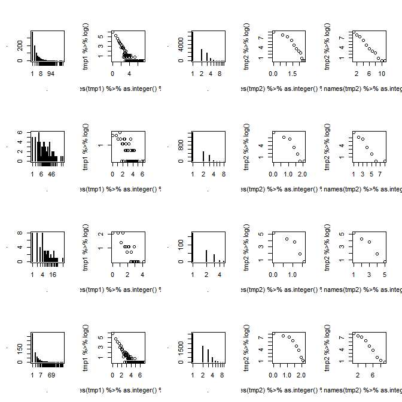<!-- --><!-- -->

``` r
print(tmp_matrix)
```

    ##       nrow ncol     1       ratio
    ## <NA> 12306 1104 21262 0.001565014
    ## <NA>  2244   99  3449 0.015525126
    ## <NA>   291   56   475 0.029148257
    ## <NA>  6835  775 13606 0.002568563
    ## <NA> 12124 1406 30448 0.001786189
    ## <NA> 11420 1314 27352 0.001822752
    ## <NA>  1483  101  2364 0.015782832
    ## <NA>  3950  782  8630 0.002793875

``` r
# matrix_gene_func_bool
max_fnum = 50
slope_f = 0
prob_func_number = seq(from = slope_f,to = 1,by = (1-slope_f)/(max_fnum-1)) %>% rev()
set.seed(1)
vector_gene_FuncNum = sample(1:max_fnum,gene_num,replace = T,prob = prob_func_number)
sum(vector_gene_FuncNum)
```

    ## [1] 170465

``` r
max_gnum = 500
slope_g = 0
prob_gene_number = seq(from = slope_g,to = 1,by = (1-slope_g)/(max_gnum-1)) %>% rev()
set.seed(1)
vector_func_GeneNum = sample(1:max_gnum,func_num,replace = T,prob = prob_gene_number)
sum(vector_func_GeneNum)
```

    ## [1] 170863

``` r
#distribution of vector_gene_FuncNum and vector_func_GeneNum
plot(table(vector_func_GeneNum),
     xlab = 'gene number',ylab = 'function number',main = 'density of gene number')
c_gene = table(vector_func_GeneNum)[1]/prob_gene_number[1]
lines(prob_gene_number*c_gene)
```

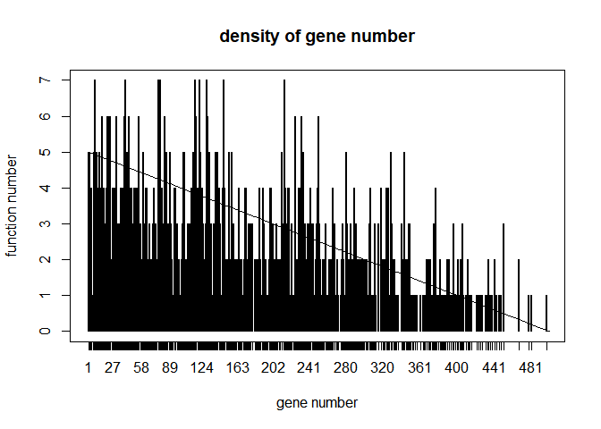<!-- -->

``` r
plot(table(vector_func_GeneNum),
     xlab = 'gene number',ylab = 'function number',main = 'density of gene number',
     log='x')
c_gene = table(vector_func_GeneNum)[1]
lines(prob_gene_number*c_gene)
```

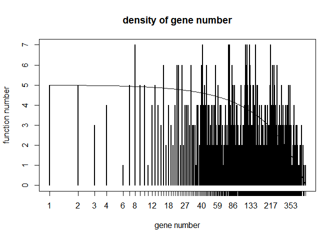<!-- -->

``` r
plot(names( table(vector_func_GeneNum)) %>% as.integer() %>% log()
     ,table(vector_func_GeneNum) %>% log())
```

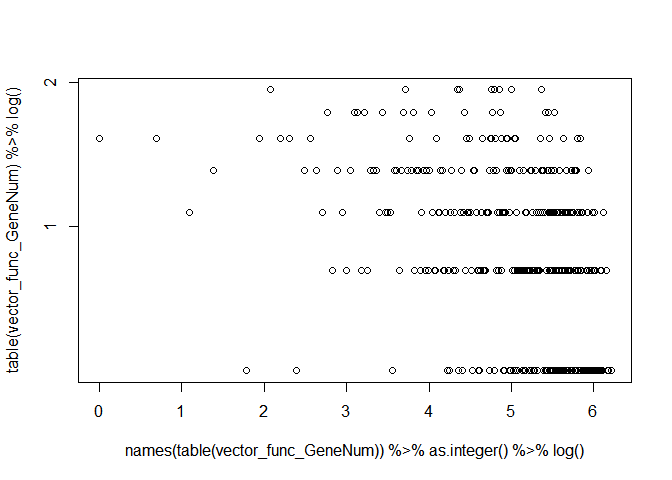<!-- -->

``` r
plot(density(vector_func_GeneNum))
```

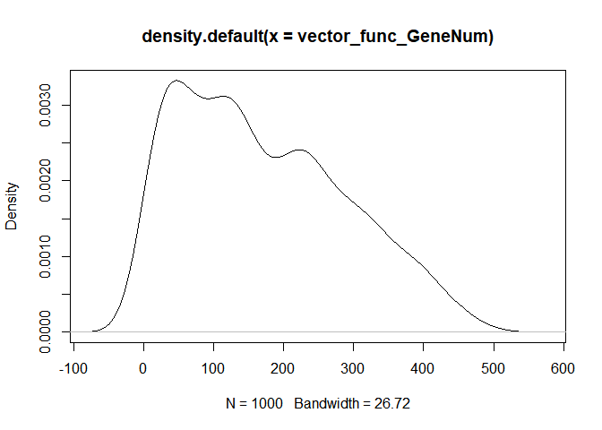<!-- -->

``` r
#
plot(table(vector_gene_FuncNum),
     xlab = 'function number',ylab = 'gene number',main = 'density of function number',
     log='')
c_func = table(vector_gene_FuncNum)[1]/prob_func_number[1]
lines(prob_func_number*c_func)
```

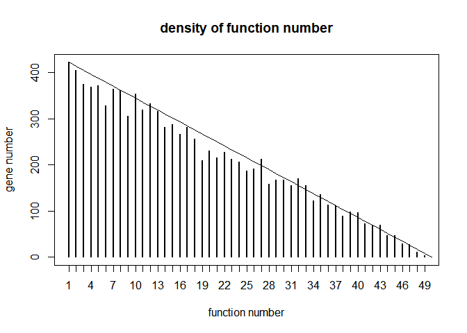<!-- -->

``` r
plot(table(vector_gene_FuncNum),
     xlab = 'function number',ylab = 'gene number',main = 'density of function number',
     log='x')
c_func = table(vector_gene_FuncNum)[1]/prob_func_number[1]
lines(prob_func_number*c_func)
```

<!-- -->

``` r
plot(density(vector_gene_FuncNum))
```

<!-- -->

``` r
vector_func_GeneNum %>% sort(decreasing = T) %>% head()
```

    ## [1] 497 481 478 467 467 451

``` r
tmp = sum(vector_func_GeneNum) - sum(vector_gene_FuncNum)
tmp
```

    ## [1] 398

``` r
f_AdjNum = function(v1 = vector_func_GeneNum,v2 = vector_gene_FuncNum,vs){
  if (sum(v1)==sum(v2)) {
    return(v1)
  }else if(sum(v1)>sum(v2)){
    for (i in vs) {
      tmp_id = which(v1>i)
      tmp_id = sample(tmp_id,1)
      v1[tmp_id] = v1[tmp_id] - i
    }
    return(v1) 
  }else if(sum(v1)<sum(v2)){
    tmp_id = which(v1 == 1)
    tmp_id = sample(tmp_id,length(vs))
    v1[tmp_id] = v1[tmp_id] + vs
    return(v1) 
  }
}
vector_func_GeneNum = f_AdjNum(vs = c(200,198))
sum(vector_func_GeneNum)
```

    ## [1] 170465

``` r
sum(vector_gene_FuncNum)
```

    ## [1] 170465

``` r
length(vector_func_GeneNum)
```

    ## [1] 1000

``` r
length(vector_gene_FuncNum)
```

    ## [1] 10000

``` r
matrix_gene_func_bool = matrix(0,nrow = gene_num,ncol = func_num)
vector_func_LoopGeneNum = vector_func_GeneNum
for (i in 1:gene_num) {
  func_id_loop = order(vector_func_LoopGeneNum,decreasing = T)[1:vector_gene_FuncNum[i]]
  matrix_gene_func_bool[i,func_id_loop] = 1
  vector_func_LoopGeneNum[func_id_loop] = vector_func_LoopGeneNum[func_id_loop]-1
}
```

``` r
plot(table(colSums(matrix_gene_func_bool)),
     xlab = 'gene number',ylab = 'function number',main = 'density of gene number',
     log='x')
```

<!-- -->

``` r
plot(names( table(colSums(matrix_gene_func_bool))) %>% as.integer() %>% log()
     ,table(colSums(matrix_gene_func_bool)) %>% log())
```

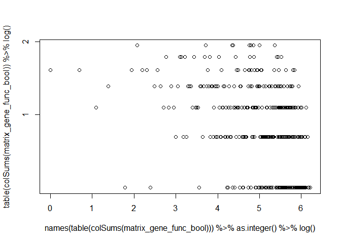<!-- -->

``` r
plot(density(vector_func_GeneNum))
```

<!-- -->

``` r
#
plot(table(rowSums(matrix_gene_func_bool)),
     xlab = 'function number',ylab = 'gene number',main = 'density of function number',
     log='')
```

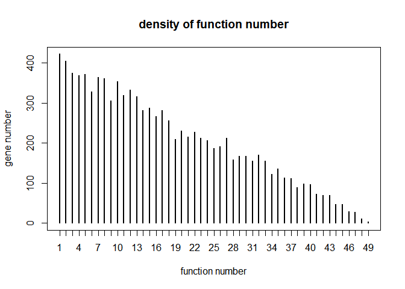<!-- -->

``` r
plot(density(vector_gene_FuncNum))
```

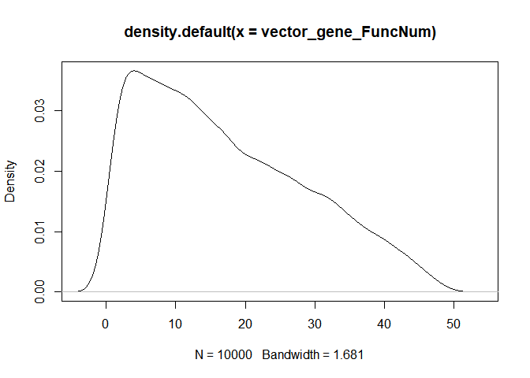<!-- -->

``` r
# matrix_gene_func_expr
set.seed(1)
matrix_gene_func_expr = matrix(0,nrow = gene_num,ncol = func_num)
matrix_gene_func_expr[matrix_gene_func_bool==1] = 
  sample(10:100,sum(matrix_gene_func_bool),replace = T)
matrix_gene_func_expr[matrix_gene_func_expr>0] %>% density() %>% plot(
  xlab = 'expression level',ylab = 'density',
  main = 'density of expression for each gene each function'
)
```

<!-- -->

``` r
# matrix_func_time
vector_func_TimeNum = sample(1:24,func_num,replace = T)
set.seed(1)
sample_prob = dnorm(seq(-2,2,by = 4/23))+0.5
```

``` r
#calculate matrix_func_time_bool
tmp = c()
set.seed(1)
for (i in 1:func_num) {
  tmp = c(tmp,sample(1:24,vector_func_TimeNum[i],replace = F,prob = sample_prob))
}
plot(sample_prob,
     xlab = 'time point',ylab = 'probability to sample',main = 'probability of function activation',
     ylim =c(0,1),
     pch = 20)
```

<!-- -->

``` r
list_func_time = cbind(rep(1:func_num,vector_func_TimeNum),tmp)
colnames(list_func_time) = c('func','time')
plot(table(vector_func_TimeNum),
     xlab = 'time number',ylab = 'function number',main = 'distribution of time number')
```

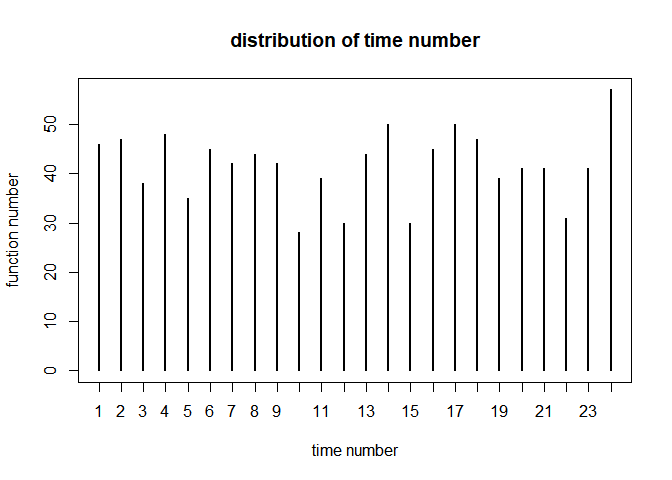<!-- -->

``` r
list_func_time[,2] %>% table() %>% plot(
  xlab = 'time point',ylab = 'function number', main = 'function number at each time point')
```

<!-- -->

``` r
# list to matrix
matrix_func_time_bool = table(list_func_time[,1],list_func_time[,2]) %>% as.matrix()
matrix_func_time_bool %>% colSums() %>% summary()
```

    ##    Min. 1st Qu.  Median    Mean 3rd Qu.    Max. 
    ##   461.0   477.5   522.5   522.4   558.2   591.0

``` r
matrix_func_time_bool %>% rowSums() %>% summary()
```

    ##    Min. 1st Qu.  Median    Mean 3rd Qu.    Max. 
    ##    1.00    6.00   13.00   12.54   18.25   24.00

``` r
matrix_func_time_bool = cbind(matrix_func_time_bool,matrix_func_time_bool,matrix_func_time_bool)
colnames(matrix_func_time_bool) = 1:72
```

``` r
matrix_gene_time_FuncNum = (matrix_gene_func_expr != 0) %*% matrix_func_time_bool
matrix_gene_time_FuncNum %>% table() %>% 
  plot(xlab = 'function number', ylab = 'frequence', main = 'distribution from function number matrix')
```

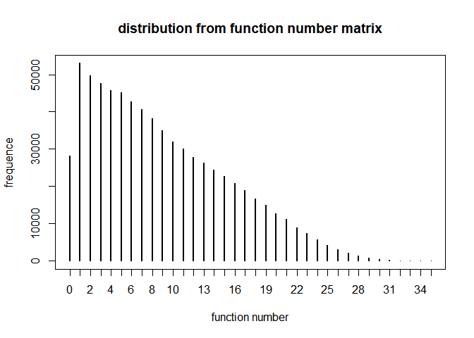<!-- -->

``` r
# matrix_gene_time
expr_need = matrix_gene_func_expr %*% matrix_func_time_bool
```

``` r
expr_need %>% density() %>% 
  plot(xlab = 'function number', ylab = 'frequence', main = 'distribution from function number matrix')
```

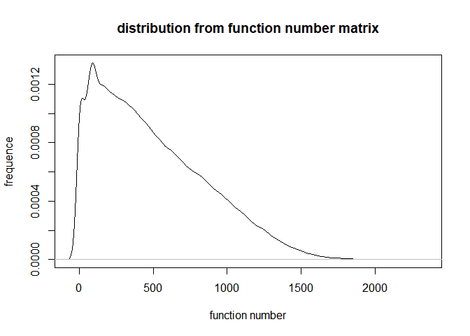<!-- -->

``` r
max_rand = 1.5
list_gene_MaxExpr = unlist(apply(expr_need, 1, max))*max_rand
expr_maxlimit = matrix(1,nrow = gene_num,ncol = 72) * list_gene_MaxExpr
```

``` r
min_rand = 0.9
expr_minlimit = expr_need*min_rand
```

``` r
expr_IncrementMaxFlex = expr_maxlimit - expr_minlimit
set.seed(1)
tmp = matrix(runif(gene_num*72),nrow = gene_num,ncol = 72)
expr_IncrementRandFlex = expr_IncrementMaxFlex * tmp
expr_rand = expr_minlimit + expr_IncrementRandFlex
```

``` r
#calculate of cost
expr_IncrementRand = expr_rand - expr_need
cost_IncrementRand = expr_IncrementRand * cost_c
cost_IncrementRandAbs = abs(cost_IncrementRand)
cost_IncrementRandBool = sign(cost_IncrementRand)
```

``` r
set.seed(1)
#pro_num_ratio = sample(x = 10:100,size = gene_num,replace = T)
pro_num_ratio = 100
```

``` r
#calculate of cost
expr_IncrementRand_pro = expr_IncrementRand * pro_num_ratio
cost_IncrementRand_pro = expr_IncrementRand_pro * cost_cpro
cost_IncrementRandAbs_pro = abs(cost_IncrementRand_pro)
cost_IncrementRandBool_pro = sign(cost_IncrementRand_pro)

cost_IncrementRandAbs_rpall = cost_IncrementRandAbs + cost_IncrementRandAbs_pro
cost_IncrementRandBool_rpall = cost_IncrementRandBool
```

``` r
f_cir_para = function(xx){
  # calculateexpr_constrained
  sele_strength = xx
  cost_IncrementConsAbs_rpall = exp(log(1+cost_IncrementRandAbs_rpall)*(1 - sele_strength))-1 
  expr_IncrementCons = cost_IncrementConsAbs_rpall/cost_IncrementRandAbs_rpall * expr_IncrementRand
  expr_constrained = expr_need + expr_IncrementCons

  # set.seed(1)
  # expr_constrained = expr_constrained+runif(720000,min = 0,max = 1)
  timelist = 1:72
  expr_out = expr_constrained
  write.csv(as.data.frame(expr_out), file = paste0("E:/circidian_algorithm/Select_strength_result/cycMouseHypoRNA",xx,".csv"), row.names=T)
  metatest = meta2d(infile=paste0("E:/circidian_algorithm/Select_strength_result/cycMouseHypoRNA",xx,".csv"), filestyle="csv",
                    outdir = 'E:/circidian_algorithm/Select_strength_result/',outputFile = F,
                    minper = 20,maxper = 28,
                    timepoints=timelist
  )
  return(sum(metatest$meta$meta2d_BH.Q<0.05))
}
sele_strength_seq = seq(0.01,0.2,by = 0.01)


res = single_parallel(func = f_cir_para
                      ,iterable = sele_strength_seq
                      ,env_val = c('cost_IncrementRandAbs_rpall','expr_IncrementRand','expr_need')
                      ,packages = c('MetaCycle','dplyr'))

cbind(sele_strength_seq,res)
```

    ##       sele_strength_seq  res
    ##  [1,]              0.01  324
    ##  [2,]              0.02  865
    ##  [3,]              0.03 1659
    ##  [4,]              0.04 2585
    ##  [5,]              0.05 3407
    ##  [6,]              0.06 4031
    ##  [7,]              0.07 4423
    ##  [8,]              0.08 4677
    ##  [9,]              0.09 4842
    ## [10,]              0.10 4954
    ## [11,]              0.11 5033
    ## [12,]              0.12 5079
    ## [13,]              0.13 5121
    ## [14,]              0.14 5147
    ## [15,]              0.15 5169
    ## [16,]              0.16 5183
    ## [17,]              0.17 5193
    ## [18,]              0.18 5196
    ## [19,]              0.19 5203
    ## [20,]              0.20 5199

``` r
plot(sele_strength_seq,res
     ,xlab = 'sele_strength',ylab = 'circadian number')
```

<!-- -->

``` r
#select select strength
sele_strength = 0.05
cost_IncrementConsAbs_rpall = exp(log(1+cost_IncrementRandAbs_rpall)*(1 - sele_strength))-1 
expr_IncrementCons = cost_IncrementConsAbs_rpall/cost_IncrementRandAbs_rpall * expr_IncrementRand
expr_constrained = expr_need + expr_IncrementCons
```

``` r
(expr_constrained - expr_need) %>% '<'(0) %>% sum()
```

    ## [1] 61377

``` r
(expr_constrained - expr_need) %>% '<'(0) %>% sum() %>% '/'(720000)
```

    ## [1] 0.08524583

``` r
#calculate cost_constrained
cost_constrained = expr_constrained * cost_c
```

``` r
#final expression data
library(MetaCycle)
expr_out = expr_constrained
timelist = 1:72
write.csv(as.data.frame(expr_out), file = paste0("cycMouseHypoRNA",sele_strength,".csv"), row.names=T)
system.time({
  metatest = meta2d(infile=paste0("cycMouseHypoRNA",sele_strength,".csv"), filestyle="csv",
                    outdir = 'example',outputFile = F,
                    minper = 20,maxper = 28,
                    timepoints=timelist
  )
})
```

    ## The ARS is in process from  15:25:35 07-09-2021 
    ## The analysis by ARS is finished at  15:28:54 07-09-2021 
    ## The JTK is in process from  15:28:54 07-09-2021 
    ## The analysis by JTK is finished at  15:33:47 07-09-2021 
    ## The LS is in process from  15:33:47 07-09-2021 
    ## The analysis by LS is finished at  15:36:29 07-09-2021 
    ## DONE! The analysis about ' cycMouseHypoRNA0.05.csv '  has been finished.
    ##                             user.self           sys.self            elapsed 
    ##       "Time used:"           "663.48"              "0.6" "664.559999999999" 
    ##         user.child          sys.child 
    ##                 NA                 NA

    ##    user  system elapsed 
    ##  663.62    0.60  664.70

``` r
# system.time({
#   metatest = meta2d(infile=paste0("cycMouseHypoRNA",sele_strength,".csv"), filestyle="csv",
#                     outdir = 'example',outputFile = T,outRawData=TRUE,
#                     minper = 20,maxper = 28,
#                     timepoints=timelist
#   )
# })


sum(metatest$meta$meta2d_BH.Q<0.05) %>% print()
```

    ## [1] 3407

``` r
# observe features of simulation data
matrix_func_time_bool %>% as.vector() %>% length()
```

    ## [1] 72000

``` r
matrix_func_time_bool %>% as.vector() %>% '=='(0) %>% sum()
```

    ## [1] 34389

``` r
expr_need %>% as.vector() %>% length()
```

    ## [1] 720000

``` r
expr_need %>% as.vector() %>% '=='(0) %>% sum()
```

    ## [1] 28290

``` r
expr_constrained %>% as.vector() %>% length()
```

    ## [1] 720000

``` r
expr_constrained %>% as.vector() %>% '=='(0) %>% sum()
```

    ## [1] 0

``` r
summary(expr_constrained %>% as.vector())
```

    ##      Min.   1st Qu.    Median      Mean   3rd Qu.      Max. 
    ##    0.0002  238.9343  504.4027  583.1394  863.5309 2669.2088

``` r
id_cir = metatest$meta$meta2d_BH.Q<0.05
matrix_gene_func_BoolCir = matrix_gene_func_bool[id_cir,]
id_tmp = colSums(matrix_gene_func_BoolCir)!=0
matrix_gene_func_BoolCir = matrix_gene_func_BoolCir[,id_tmp]
```

``` r
matrix_gene_func_bool %>% colSums() %>% table() %>%
  plot(log='x'
       ,xlab = 'gene numbers in one function',ylab = 'frequence')
text(70,300
     ,paste0('mean=',matrix_gene_func_bool %>% colSums() %>% mean() %>% round(digits = 2))
     ,cex = 1.2)
```

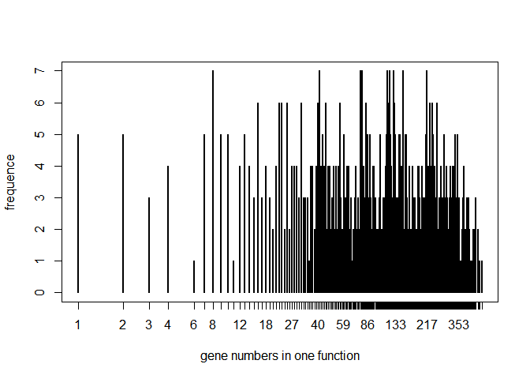<!-- -->

``` r
matrix_gene_func_BoolCir %>% colSums() %>% table() %>%
  plot(log='x'
       ,xlab = 'circadian gene numbers in one function',ylab = 'frequence')
text(40,150
     ,paste0('mean=',matrix_gene_func_BoolCir %>% colSums() %>% mean() %>% round(digits = 2))
     ,cex = 1.2)
```

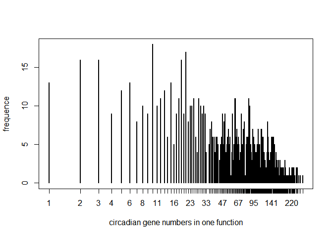<!-- -->

``` r
matrix_gene_func_bool %>% rowSums() %>% table() %>%
  plot(log=''
       ,xlab = 'function numbers in one gene',ylab = 'frequence')
text(12,2500
     ,paste0('mean=',matrix_gene_func_bool %>% rowSums() %>% mean() %>% round(digits = 2))
     ,cex = 1.2)
```

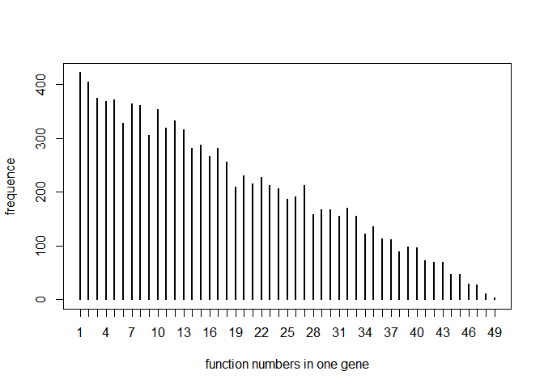<!-- -->

``` r
matrix_gene_func_BoolCir %>% rowSums() %>% table() %>%
  plot(log=''
       ,xlab = 'function numbers in one circadian gene',ylab = 'frequence')
text(12,300
     ,paste0('mean=',matrix_gene_func_BoolCir %>% rowSums() %>% mean() %>% round(digits = 2))
     ,cex = 1.2)
```

<!-- -->

``` r
(matrix_gene_func_BoolCir %>% rowSums() %>% table() /
    (matrix_gene_func_bool %>% rowSums() %>% table())[rownames(
      matrix_gene_func_BoolCir %>% rowSums() %>% table())]) %>%
  plot(
    main = 'simulation',ylab = 'cir/all ratio',xlab = 'function number'
  )
```

<!-- -->

``` r
tmp1 = (matrix_gene_func_bool[metatest$meta$meta2d_BH.Q<0.05,] %>% colSums())
tmp2 = matrix_gene_func_bool %>% colSums()
point_pcc(log10(tmp2[tmp1!=0]),log10(tmp1[tmp1!=0])
          ,main = 'simulation',ylab = 'log10(cir number)',xlab = 'log10(term size)'
          ,textx = 0.1,text1y = 2,text2y = 1.6)
```

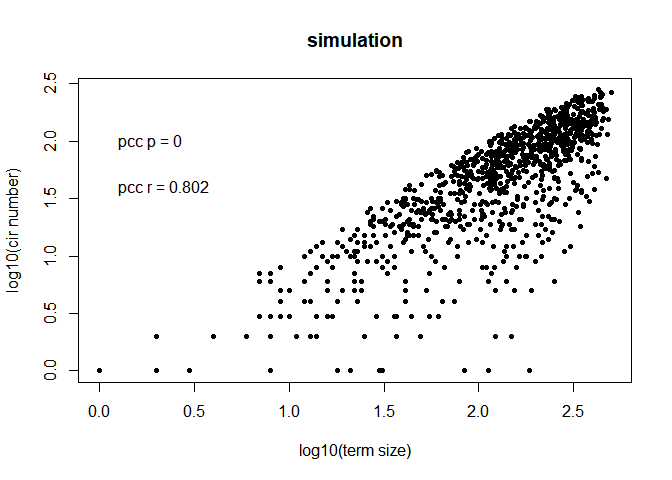<!-- -->

``` r
tmp1 = (matrix_gene_func_bool[metatest$meta$meta2d_BH.Q<0.05,] %>% colSums()) /
  (matrix_gene_func_bool %>% colSums())
tmp2 = matrix_gene_func_bool %>% colSums()
point_pcc(log10(tmp2[tmp1!=0]),tmp1[tmp1!=0]
          ,xlab = 'log10(term size)',main = 'simulation',ylab = 'cir/all ratio'
          ,textx = 0,text1y = 0.2,text2y = 0.1)
```

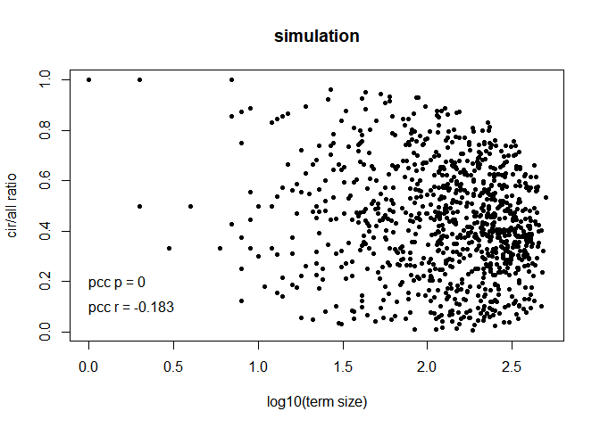<!-- -->

``` r
cor.test(log10(tmp2[tmp1!=0]),tmp1[tmp1!=0])
```

    ## 
    ##  Pearson's product-moment correlation
    ## 
    ## data:  log10(tmp2[tmp1 != 0]) and tmp1[tmp1 != 0]
    ## t = -5.833, df = 984, p-value = 7.382e-09
    ## alternative hypothesis: true correlation is not equal to 0
    ## 95 percent confidence interval:
    ##  -0.2424785 -0.1217722
    ## sample estimates:
    ##        cor 
    ## -0.1828142

``` r
id_tmp = sample(gene_num,sum(metatest$meta$meta2d_BH.Q<0.05))
tmp1 = (matrix_gene_func_bool[id_tmp,] %>% colSums())
tmp2 = matrix_gene_func_bool %>% colSums()
point_pcc(log10(tmp2[tmp1!=0]),log10(tmp1[tmp1!=0])
          ,main = 'simulation',ylab = 'log10(cir number)',xlab = 'log10(term size)'
          ,textx = 0.1,text1y = 2,text2y = 1.6)
```

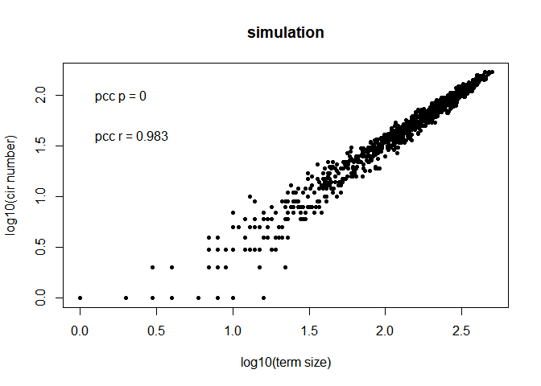<!-- -->

``` r
tmp1 = (matrix_gene_func_bool[id_tmp,] %>% colSums()) /
  (matrix_gene_func_bool %>% colSums())
tmp2 = matrix_gene_func_bool %>% colSums()
point_pcc(log10(tmp2[tmp1!=0]),tmp1[tmp1!=0]
          ,xlab = 'log10(term size)',main = 'simulation',ylab = 'cir/all ratio'
          ,textx = 0,text1y = 0.2,text2y = 0.1)
```

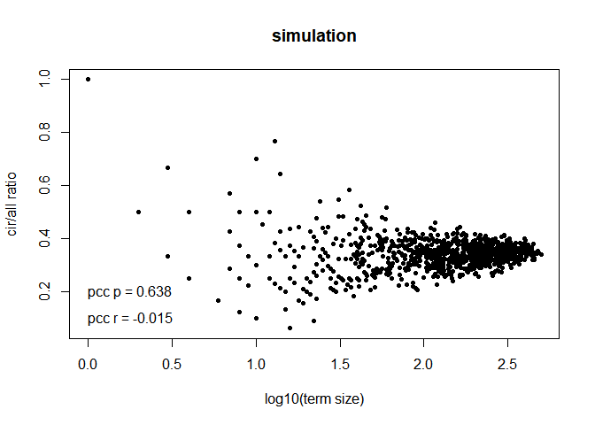<!-- -->

``` r
cor.test(log10(tmp2[tmp1!=0]),tmp1[tmp1!=0])
```

    ## 
    ##  Pearson's product-moment correlation
    ## 
    ## data:  log10(tmp2[tmp1 != 0]) and tmp1[tmp1 != 0]
    ## t = -0.46997, df = 987, p-value = 0.6385
    ## alternative hypothesis: true correlation is not equal to 0
    ## 95 percent confidence interval:
    ##  -0.07722263  0.04742366
    ## sample estimates:
    ##         cor 
    ## -0.01495759

``` r
plot(colSums(matrix_func_time_bool),type = 'l')
```

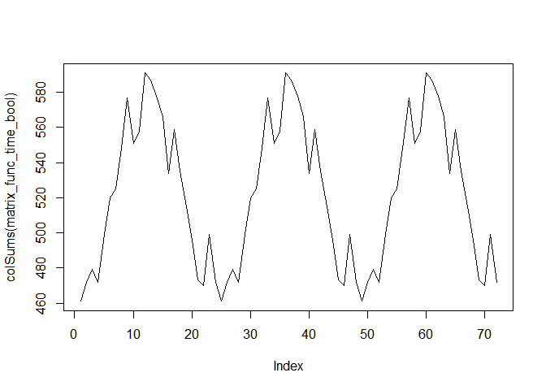<!-- -->

``` r
id_cir = metatest$meta$meta2d_BH.Q<0.05
plot(metatest$meta$meta2d_Base,metatest$meta$meta2d_AMP,log = 'xy',
     xlab = 'log(expr)',ylab = 'log(amp)')
```

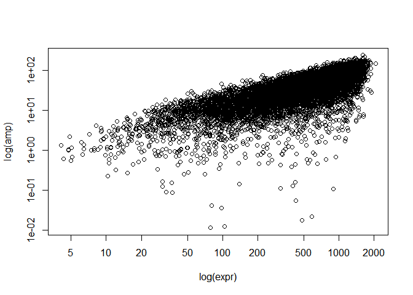<!-- -->

``` r
plot(metatest$meta$meta2d_Base[id_cir],metatest$meta$meta2d_AMP[id_cir],log = 'xy',
     xlab = 'log(expr)',ylab = 'log(amp)')
```

<!-- -->

``` r
rowmean_cost = rowMeans(expr_constrained)
plot(metatest$meta$meta2d_Base[id_cir],rowmean_cost[id_cir],log = 'xy',
     xlab = 'log(expr)',ylab = 'log(cost)')
```

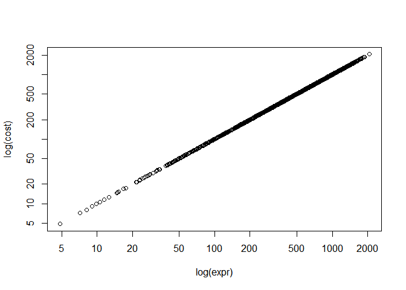<!-- -->

``` r
plot(n_level_num(data = rowMeans(expr_constrained),id = id_cir)
     ,type = 'l',
     ylab = 'circadian gene number')
```

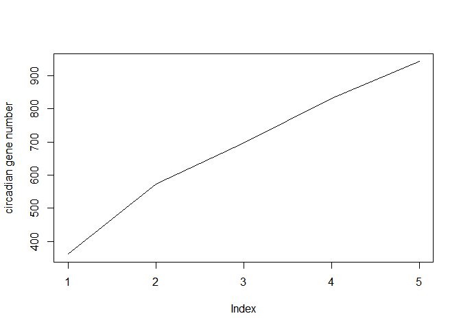<!-- -->

``` r
tmp = n_level_num(apply(expr_constrained, 1, function(x){max(x) - min(x)}) %>% unlist,id = id_cir)
plot(tmp,type = 'l',ylab = 'circadian gene number')
```

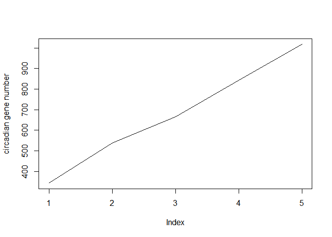<!-- -->
